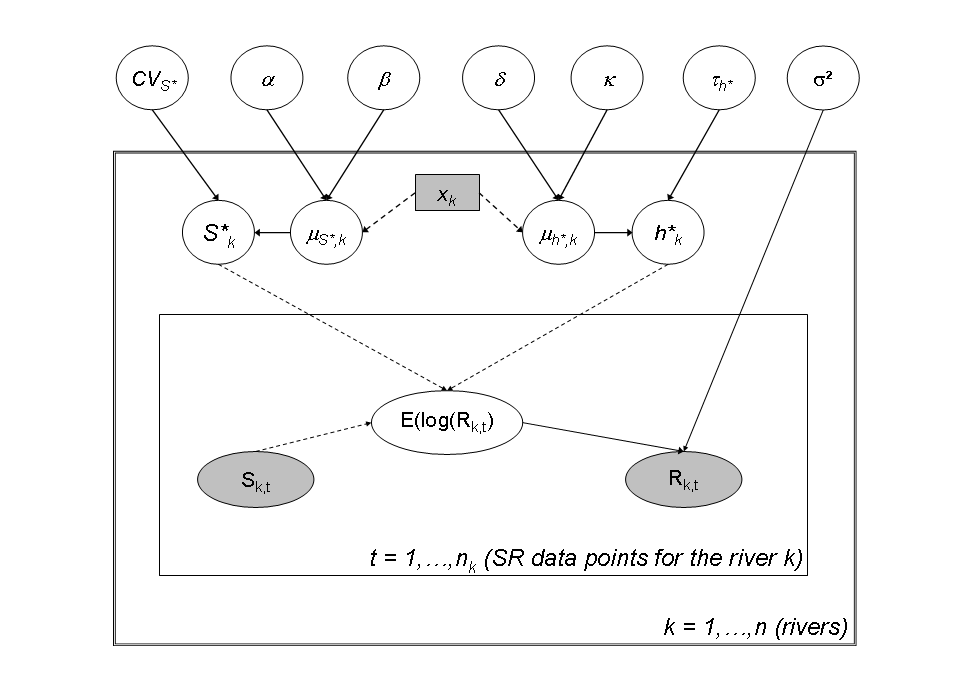

```{r, include = FALSE}
knitr::opts_chunk$set(
  collapse = TRUE,
  comment = "#>",
  fig.retina = 2
)
```

```{r setup}
library(hbm4ecology)
library(rstan)
library(posterior)
library(tidyverse)
#plot_theme <- theme_set(theme_classic(base_size = 15L))
plot_theme <-  theme_classic(base_size = 15L) + theme(axis.text.x =  element_text(angle = 90),
                                  strip.background = element_rect(fill = "#4da598"),
                                  strip.text = element_text(size = 15))
```


This article develops a hierarchical extension of the Ricker Stock Recruitment
model. The data and models are based on a published paper by Pr{\'{e}}vost et al. @Prevost2003; but see also
@PrevostChaput2001.

We show that the hierarchical assemblage of several
salmon populations which we model as exchangeable units appears
 as the working solution to transfer information and borrow strength
from data-rich to data-poor situations. 
 The data structure is sophisticated with Normal latent 
vectors, and the probabilistic structures have to be designed
conditionally on some available covariates, namely the latitude and the
riverine wetted area accessible to salmon. 

## Data

```{r}
data("SRSalmon")
```


The analysis of stock and
recruitment (SR) relationships is the most widely used approach for deriving
*Biological Reference Points* in fisheries sciences. It is particularly
well suited for anadromous salmonid species for which the recruitment of
juveniles in freshwater is more easily measured than the recruitment of marine
species. SR relationships are critical
for setting reference points for the management of salmon populations, such as
the spawning target $S^{\ast}$, a biological reference point for the number of
spawners which are necessary to guarantee an optimal sustainable exploitation,
or the maximum sustainable exploitation rate $h^{\ast}$.


```{r}
tibble(
  River = SRSalmon$name_riv,
  Country = SRSalmon$country_riv,
  Latitude = SRSalmon$lat,
  `Area accessible to salmon` = SRSalmon$area
) %>% knitr::kable()
```


```{r}
tib <- tibble(Obs = seq(SRSalmon$n),
              River = SRSalmon$riv,
              Stock = SRSalmon$S,
              Recruitment = SRSalmon$R)
knitr::kable(bind_rows(head(tib), tail(tib)))
```

<center>

{width=70% height=70%}

</center>


There are several hundreds of salmon stocks in the northeast Atlantic area,
each having its own characteristics with regard to the size and productivity
of the salmon populations. But resources to collect SR data are limited and
suitable SR series (both in terms of length and reliability of observations)
such as the ones of `SRSalmon` are only available for a handful of monitored 
rivers spread throughout the European area of distribution of the species.
These so-called *index rivers* are a representative sample from the
salmon rivers located in western Europe and under the influence of the Gulf
Stream. This sample covers a broad area including Spain, France, UK, Ireland,
Norway, the western coast of Sweden and the southwestern coast of Iceland. The collection and pre-processing procedures 
used to obtain the data ready for SR analysis presented in Table
<!-- \ref{tab5x6:13rivers} and Fig. \ref{Fig5x6:FittedSR_13rivers} -->
are described in detail in @Crozier2003 or @Prevost2003.
Here, hierarchical modeling will be used to address two questions:

* How is the SR information transferred from the monitored data-rich
rivers to set Biological Reference Points for other sparse-data salmon rivers,
while accounting for the major sources of uncertainty?
* How can the joint analysis of the SR relationship for the 13 index
rivers be used to forecast biological reference points for a new river without
any SR data but for which relevant covariates are available?


# Model without covariates

Ricker model with lognormal errors and management related parametrization

* $\log(R_{k,t}) = h_{k}^{*} + \log(\frac{S_{k,t}}{1-h^{*}{t}}) - \frac{h^{*}_{k}}{S^{*}_{k}}S_{k,t} + \epsilon_{k,t}$
* $\epsilon_{k,t} \overset{iid}{\sim} Normal(0, \sigma_k^2)$

### Defining priors for the model 

* $h_k^* \sim Beta(1,1)$
* $\tau = \sigma^{-2} \sim Gamma(p = 10^{-3},q = 10^{-3})$ with $\sigma_k = \sigma$, $\forall k$

With two different elicitation for $S^*_k$:

a simple uniform ellicitation:

* $S_k^* \sim Uniform(0,200)$

or a more refined gamma elicitation:

- $\mu_{S^*} = 40 \text{eggs/$m^2$}$
- $CV_{S^*} = 1$
- $a = CV_{S^*}^{-2}$
- $b = \mu_{S^*}^{-1}CV_{S^*}^{-2}$
- $S_k^* \sim Gamma(a,b) \mathbf{1}_{S_k^* < 200}$


## Implementation and esimation of the models in Stan


```{r}
glimpse(SRSalmon)
```


### Model with no covariates and with uniform ellicitation for $S^*$

```{r unif-model}
hsr_model_stan <- "
data {
  int n_riv; // Number of rivers
  int n_obs[n_riv]; // Number of observations by rivers
  int n; // Total number of observations
  int riv[n]; // River membership (indices k)
  vector[n] S; // Stock data
  vector[n] R; // Recruitment data
}

parameters {
  vector<lower=0, upper=200>[n_riv] Sopt;
  vector<lower=0, upper=1>[n_riv] hopt;
  real<lower=0> tau;
}

transformed parameters {
  vector<lower=0>[n_riv] alpha;
  vector<lower=0>[n_riv] beta ;
  real<lower=0> sigma;
  // real Copt;
  // real Ropt;
  vector[n] LogR;
  // real Slope;
  
  for (k in 1:n_riv) {
    alpha[k] = exp(hopt[k])/(1-hopt[k]) ;  
    beta[k] = hopt[k]/Sopt[k]     ;    
  }
  sigma = tau^-0.5        ;  
  // Copt = hopt*Sopt/(1-hopt);
  // Ropt = Sopt + Copt;
  // Slope = exp(alpha);
  for (t in 1:n) {
    LogR[t] = log(S[t]) + log(alpha[riv[t]]) - beta[riv[t]]*S[t] ;  // LogR[t] is the logarithm of the Ricker function  
  }
}

model {
  tau ~ gamma(.001, .001) ; // Diffuse prior for the variance
  for (k in 1:n_riv) {
    hopt[k] ~ beta(1,1) ;   
    Sopt[k] ~ uniform(0, 200) ;
  }
// 
    log(R) ~ normal(LogR, sigma) ;
}
"
```


```{r unif-compil, cache=TRUE}
model_name <-"HSR_Ricker_LogN_Management"
sm <- stan_model(model_code =  hsr_model_stan,
                 model_name =  model_name
)
```


```{r unif-sample, cache=TRUE, message=FALSE}
options(mc.cores = parallel::detectCores())
set.seed(1234)
# Number iteration for the "warm up" phase
n_warm <- 2500
# Number iteration for inferences
n_iter <- 5000
n_thin <- 1
# Number of chains
n_chains <- 4

# Inferences
fit <- sampling(object = sm,
                data = SRSalmon, 
                pars = NA, #params,
                chains = n_chains, 
                iter = n_iter, 
                warmup = n_warm, 
                thin = n_thin, 
                control = list("adapt_delta" = .85) # Acceptance rate up from .8 to remove some divergent transitions
                #control = list("max_treedepth" = 12)
)
```

Diagnostic of the convergence:


```{r unif-diagnostic}
params<-c("Sopt","hopt","tau")
stan_rhat(fit)
monitor(rstan::extract(fit, pars = params, permuted = FALSE, inc_warmup = TRUE))
print(fit, par = c("lp__", params) )
```

```{r}
dfw_unif <- extract_wider(fit)
dfl_unif <- extract_longer(fit)

dfl_unif %>% 
  filter(str_detect(parameter, "Sopt")) %>% 
  mutate(Site = HSrAsalmon$name_riv[as.integer(str_sub(parameter, str_length("Sopt.") + 1))]) %>% 
  ggplot(aes(y = log(value), x = Site)) +
  geom_boxplot(fill = "grey80") +
  ylab("log(S*)") +
  plot_theme

```

```{r}
dfl_unif %>% 
  filter(str_detect(parameter, "hopt")) %>% 
  mutate(Site = HSrAsalmon$name_riv[as.integer(str_sub(parameter, str_length("hopt.") + 1))]) %>% 
  ggplot(aes(y = log(value), x = Site)) +
  geom_boxplot(fill = "grey80") +
  ylab("log(h*)") +
  plot_theme
```

### Model with no covariates and with Gamma prior for $S*$

```{r gamma-model}
hsr_model_indep_S_gamma_stan <- "
data {
  int n_riv; // Number of rivers
  int n_obs[n_riv]; // Number of observations by rivers
  int n; // Total number of observations
  int riv[n]; // River membership (indices k)
  vector[n] S; // Stock data
  vector[n] R; // Recruitment data
}

parameters {
  vector<lower=0, upper=200>[n_riv] Sopt;
  vector<lower=0, upper=1>[n_riv] hopt;
  real<lower=0> tau;
}

transformed parameters {
  vector<lower=0>[n_riv] alpha;
  vector<lower=0>[n_riv] beta ;
  real<lower=0> sigma;
  // real Copt;
  // real Ropt;
  vector[n] LogR;
  // real Slope;
  
  for (k in 1:n_riv) {
    alpha[k] = exp(hopt[k])/(1-hopt[k]) ;  
    beta[k] = hopt[k]/Sopt[k]     ;    
  }
  sigma = tau^-0.5        ;  
  // Copt = hopt*Sopt/(1-hopt);
  // Ropt = Sopt + Copt;
  // Slope = exp(alpha);
  for (t in 1:n) {
    LogR[t] = log(S[t]) + log(alpha[riv[t]]) - beta[riv[t]]*S[t] ;  // LogR[t] is the logarithm of the Ricker function  
  }
}

model {
  tau ~ gamma(.001, .001) ; // Diffuse prior for the variance
  for (k in 1:n_riv) {
    hopt[k] ~ beta(1,1) ;   
    Sopt[k] ~ gamma(1, 1./1600) ;
  }
// 
    log(R) ~ normal(LogR, sigma) ;
}
"
```

```{r gamma-compil, cache = TRUE, message=FALSE}

model_name <-"HSR_Ricker_LogN_Management_S_gamma"
sm <- stan_model(model_code =  hsr_model_indep_S_gamma_stan,
                 model_name =  model_name
)
```


```{r gamma-fit, cache = TRUE}
set.seed(1234)
# Number iteration for the "warm up" phase
n_warm <- 2500
# Number iteration for inferences
n_iter <- 5000
n_thin <- 1
# Number of chains
n_chains <- 4

params<-c("Sopt","hopt","tau")
# Inferences


fit <- sampling(object = sm,
                data = SRSalmon, 
                pars = NA, #params,
                chains = n_chains, 
                iter = n_iter, 
                warmup = n_warm, 
                thin = n_thin, 
                control = list("adapt_delta" = .85)# Acceptance rate up from .8 to remove some divergent transitions
)
```

Diagnostic of the convergence:

```{r gamma-diagnostic}
params<-c("Sopt","hopt","tau")
stan_rhat(fit)
monitor(rstan::extract(fit, pars = params, permuted = FALSE, inc_warmup = TRUE))
print(fit, par = c("lp__", params) )
```

```{r}
dfw_gamma <- extract_wider(fit) %>% mutate(Model = "Gamma")
dfl_gamma <- extract_longer(fit)

dfl_gamma %>% 
  filter(str_detect(parameter, "Sopt")) %>% 
  mutate(Site = HSrAsalmon$name_riv[as.integer(str_sub(parameter, str_length("Sopt.") + 1))]) %>% 
  ggplot(aes(y = log(value), x = Site)) +
  geom_boxplot(fill = "grey80") +
  ylab("log(S*)") +
  plot_theme

```

```{r}
dfl_gamma %>% 
  filter(str_detect(parameter, "hopt")) %>% 
  mutate(Site = HSrAsalmon$name_riv[as.integer(str_sub(parameter, str_length("hopt.") + 1))]) %>% 
  ggplot(aes(y = log(value), x = Site)) +
  geom_boxplot(fill = "grey80") +
  ylab("log(h*)") +
  plot_theme
```


The choice of the prior distribution of $S^*$ does not make much difference on the posterior distribution estimate.


```{r}
bind_rows(dfl_unif %>% mutate (Model =  "Uniform"), dfl_gamma %>%  mutate(Model = "Gamma")) %>% 
  filter(str_detect(parameter, "Sopt")) %>% 
  mutate(Site = HSrAsalmon$name_riv[as.integer(str_sub(parameter, str_length("Sopt.") + 1))]) %>%
  ggplot(aes(x = log(value), linetype = Model, color = Model)) +
  geom_density() +
  facet_wrap(~ Site) + 
  xlab("log(S*)") +
  plot_theme
```


# Hierarchical model with latitudinal covariates

The hierarchical modeling is designed to improve the estimation of parameters 
$S^*$ and $h^*$ for data-poor rivers by borrowing strength from data-rich rivers.
It is then designed to capture the between-rivers variability of the parameters 
($S^*$, $h^*$) conditionnaly on the latitude.
This can be done by introducing a log-linear relationship between the expectation 
of $S^*_k$ and the latitude of the river $x_k$:

* $\log(\mu_{S^*_k}) = \alpha x_k + \beta$
* $\alpha \sim Uniform(-5,5)$
* $\beta \sim Uniform(-50,50)$

$S^*_k$ is drawn from a Gamma distribution which the parameters depend on the 
latitude:

* $CV_{S^*} ~ Uniform(0,20)$
* $a_k = \frac{1}{CV_{S*}^2}$
* $b_k = \frac{1}{\mu_{S^*_k}CV^2_{S^*}}$
* $S^*_k \sim Gamma(a_k, b_k)1_{S^*_k<200}$

Then we express the linear linear relationship between the expectation 
of $h^*_k$ and the latitude of the river $x_k$ on a logit scale:

* $logit(\mu_{h^*_k}) = \delta x_k + \kappa$
* $\delta \sim Uniform(-5,5)$
* $\kappa \sim Uniform(-50,50)$

Given the expected mean in the logit scale, $logit(h_{k}^{\ast})$ for each
river $k$ is drawn in a Normal distribution with expected mean 
$logit(\mu_{h_{k}^{\ast}})$ and precision $\tau_{h^{\ast}}^{-2}$. A diffuse prior 
is set on the precision:

* $logit(h^*_k) \sim Normal(logit(\mu_k^*), \tau^2)$
* $\tau^{-2} \sim Gamma(.001, .001)$


<center>

{width=70% height=70%}

</center>

```{r}
hsr_model_hier_S_gamma_stan <- "
data {
  int n_riv; // Number of rivers
  int n_obs[n_riv]; // Number of observations by rivers
  int n; // Total number of observations
  int riv[n]; // River membership (indices k)
  vector<lower=0>[n] S; // Stock data
  vector<lower=0>[n] R; // Recruitment data
  vector[n_riv] lat; //Latitude of rivers
  int n_pred;
  vector[n_pred] lat_pred;
}

transformed data {
  vector[n_riv] lat_rescaled;
//  real CV_S;
//  real a;
//  a = 1/(CV_S*CV_S);
  lat_rescaled = lat-mean(lat);
}

parameters {
  real<lower=0> tau;

  real<lower=0, upper=20> CV_S;
  real<lower=-5, upper=5> alpha;
  real<lower=-50, upper=50> beta;
  vector<lower=0, upper=200>[n_riv] Sopt;  
  
  
  real<lower=-5, upper=5> delta;
  real<lower=-50, upper=50> kappa;
  real<lower=0> tau_h;
  vector[n_riv] logit_h;
  //vector[n_riv] logit_h_raw; // centered parametrization for logit_h

}

transformed parameters {
  
  real<lower=0> sigma;      // stdev for lognormal noise
  
//  vector[n_riv] log_mu_S; // log of the expected mean of Sopt
  vector<lower=0>[n_riv] mu_S; // Expected mean of Sopt  
  real<lower=0> a; // parameters of the gamma prior of Sopt
  vector<lower=0>[n_riv] b; // parameters of the gamma prior of Sopt
  
  real<lower=0> sigma_h; // stdev for logit of h 
  vector[n_riv] logit_mu_h; // logit of the expected mean of hopt
  vector<lower=0, upper=1>[n_riv] hopt; 
  
  //vector[n_riv] logit_h;   // logit of hopt
  vector[n] LogR;
  
  

  sigma = tau^-0.5  ;
  sigma_h = tau_h^-0.5 ;

  for (k in 1:n_riv) {
    mu_S[k] = exp(alpha * (lat[k]) + beta) ;
//    mu_S[k] = exp(alpha * (lat_rescaled[k]) + beta) ;
//    mu_S[k] = exp(log_mu_S[k]);
    logit_mu_h[k] = delta * (lat[k]) + kappa ;
//    logit_mu_h[k] = delta * (lat_rescaled[k]) + kappa ;
   // logit_h[k] = logit_mu_h[k] + sigma_h * logit_h_raw[k];
  }
  
  a = 1/square(CV_S) ;
  for (k in 1:n_riv) {
    b[k] = 1/(mu_S[k]*square(CV_S)) ;
  }  
  hopt = inv_logit(logit_h) ;


  for (t in 1:n) {
    LogR[t] = hopt[riv[t]] + log(S[t]) - log(1 - hopt[riv[t]]) - hopt[riv[t]]/Sopt[riv[t]]*S[t] ;  // LogR[t] is the logarithm of the Ricker function  
  }
}

model {
//  alpha ~ uniform(-5, 5);
//  beta ~ uniform(-50, 50);
//  CV_S ~ uniform(0, 20);
  
//  delta ~ uniform(-5, 5);
//  kappa ~ uniform(-50, 50);


  tau ~ gamma(.001, .001) ; // Diffuse prior for the precision
  tau_h ~ gamma(.001, .001) ; // Diffuse prior for the precision


  //logit_h_raw ~ std_normal();
  for (k in 1:n_riv) {
    logit_h[k] ~ normal(logit_mu_h[k], sigma_h);
    Sopt[k] ~ gamma(a, b[k]) ; // T[0,200] ;
  }

  
  log(R) ~ normal(LogR, sigma) ;
}

generated quantities {
  real a_pred;
  vector[n_pred] b_pred;
  vector[n_pred] Sopt_pred;
  vector[n_pred] logit_hopt_pred;
  vector<lower=0,upper=1>[n_pred] hopt_pred;
  // Posterior Predictive for new rivers with latitude lat_pred[p]
  a_pred = 1/(CV_S*CV_S);
  for ( p in 1 : n_pred ) {
//    b_pred[p] = a/(exp(alpha * lat_pred[p] + beta - alpha * mean(lat)));
    b_pred[p] = a_pred*(1/exp(alpha * lat_pred[p] + beta));
    Sopt_pred[p] = gamma_rng(a_pred,b_pred[p]); //T[0,200];
//    logit_hopt_pred[p] = normal_rng(exp(delta * lat_pred[p] + kappa - delta * mean(lat)), sigma_h);`
    logit_hopt_pred[p] = normal_rng(delta * lat_pred[p] + kappa, sigma_h);
    hopt_pred[p] = inv_logit(logit_hopt_pred[p]);
  } // end loop on predictions p
} 
"
```


```{r cache=TRUE}
model_name_hier <-"HSR_Ricker_LogN_Management_S_gamma_hier"
sm_hier <- stan_model(model_code =  hsr_model_hier_S_gamma_stan,
                 model_name =  model_name_hier)
```


```{r cache=TRUE}

# Inferences
set.seed(1234)

fit_hier <- sampling(object = sm_hier,
                data = SRSalmon, 
                pars = NA, #params,
                chains = n_chains,
                # init = lapply(seq(4), function(x)
                #   list(alpha = 0, beta = 0)),
                iter = 5000, 
                warmup = 2500, 
                thin = 1,
                control = list("adapt_delta"= .9)#list("max_treedepth" = 12)
)
```


Diagnostic of the convergence:


```{r hier-diagnostic}
params<-c("Sopt","hopt","tau", "delta", "kappa", "alpha", "beta", "CV_S")
stan_rhat(fit_hier)
monitor(rstan::extract(fit_hier, pars = params, permuted = FALSE, inc_warmup = TRUE))
print(fit_hier, par = c("lp__", params) )
```

The few divergent transitions does not seem to have any particular shape.

```{r}
pairs_list <- lapply(seq(SRSalmon$n_riv),
       function(k)  pairs(fit_hier, 
                          pars = c(paste0("Sopt[", k, "]"), 
                                   paste0("hopt[", k, "]"))) )
```


# Results and analysis

```{r}
names_ind <- SRSalmon$name_riv#c("Nivelle","Oir","Frome","Dee","Burrishoole","Lune","Bush",
#"Mourne","Faughan","Girnock Burn","North Esk","Laerdalselva","Ellidaar")

names_pred <- c("Nivelle","new 45?","Oir","new 50?","Frome","Dee","Burrishoole","Lune","new 55?","Bush",
"Mourne","Faughan","Girnock Burn","North Esk","new 60?","Laerdalselva","Ellidaar","new 65?")
```

```{r}
dfw_hier <- extract_wider(fit_hier)
dfl_hier <- extract_longer(fit_hier) %>% mutate(Model = "Hierarchical")
```


Plotting Figure 9., Page 210

```{r}
Sopt_hier <- dfl_hier %>% 
  filter(str_detect(parameter, "Sopt\\.")) %>% 
  mutate(Site = as_factor(str_sub(parameter, str_length("Sopt.")+1))) %>% 
  group_by(Site) %>% summarise(Sopt_med = median(value))%>% 
  select(Sopt_med) %>% as_vector()
```


```{r}
hopt_hier <- fit_hier %>% extract_longer() %>% 
  filter(str_detect(parameter, "hopt\\.")) %>% 
  mutate(Site = as_factor(str_sub(parameter, str_length("hopt.")+1))) %>% 
  group_by(Site) %>% summarise(hopt_med = median(value))%>% 
  select(hopt_med) %>% as_vector()
```


```{r}
Sopt_ind <- dfl_gamma %>% 
  filter(str_detect(parameter, "Sopt\\.")) %>% 
  mutate(Site = as_factor(str_sub(parameter, str_length("Sopt.")+1))) %>% 
  group_by(Site) %>% summarise(Sopt_med = median(value))%>% 
  select(Sopt_med) %>% as_vector()
```


```{r}
hopt_ind <- dfl_gamma %>% 
  filter(str_detect(parameter, "hopt\\.")) %>% 
  mutate(Site = as_factor(str_sub(parameter, str_length("hopt.")+1))) %>% 
  group_by(Site) %>% summarise(Sopt_med = median(value))%>% 
  select(Sopt_med) %>% as_vector()
```


```{r}
max_S <- sapply(seq_along(Sopt_ind), function(k) max(SRSalmon$S[SRSalmon$riv == k]))
Splot <- seq(0,100,length.out=1000)
Rplot_ind <- lapply(seq_along(Sopt_ind),
  function(k) {
    tibble(S = Splot[1:ceiling(15*max_S[k])],
           river = as_factor(names_ind[k]),
           R = exp( log(Splot[1:ceiling(15*max_S[k])]) + hopt_ind[k] - 
                     log(1-hopt_ind[k]) - (hopt_ind[k]/Sopt_ind[k])*Splot[1:ceiling(15*max_S[k])] ))
    })%>% 
  bind_rows()
```


```{r}
Rplot_hier <- lapply(seq_along(Sopt_hier),
  function(k) {
    tibble(S = Splot[1:ceiling(15*max_S[k])],
           river = as_factor(names_ind[k]),
           R = exp( log(Splot[1:ceiling(15*max_S[k])]) + hopt_hier[k] - 
                     log(1-hopt_hier[k]) - (hopt_hier[k]/Sopt_hier[k])*Splot[1:ceiling(15*max_S[k])] ))
    })%>% 
  bind_rows()

```


```{r}
tibble(R = SRSalmon$R, S = SRSalmon$S, 
       river = factor(names_ind[SRSalmon$riv], levels = names_ind)) %>% 
  ggplot() +
  aes(x = S, y = R) +
  geom_point() +
  facet_wrap(~ river, scales = "free") +
  geom_line(data = Rplot_hier, size = 1) + 
  geom_line(data = Rplot_ind, size = 1, linetype = "dashed") +
  plot_theme + 
  theme(axis.text.x =  element_text(angle = 0))
```


```{r}
dfl <- bind_rows(dfl_gamma %>%  mutate(Model = "Independent"), dfl_hier)

dfl %>% 
  filter(str_detect(parameter, "Sopt\\.")) %>%
  rename("S*" = value) %>% 
  mutate(Site = as_factor(str_sub(parameter, str_length("Sopt.") + 1))) %>%  
  ggplot() +
  aes(x = Site, y = log(`S*`), fill = Model ) +
  geom_boxplot(outlier.shape = NA, outlier.size = .25) +
  scale_x_discrete(labels = names_ind, guide = guide_axis(angle = 90)) +
  ylim(c(-3,6)) +
  scale_fill_manual(values = c("gray50", "gray90")) +
  ylab("log(S*)") +
  plot_theme
```


```{r}
dfl %>% 
  filter(str_detect(parameter, "hopt\\.")) %>%
  rename("h*" = value) %>% 
  mutate(Site = as_factor(str_sub(parameter, str_length("hopt.") + 1))) %>% 
  ggplot() +
  aes(x = Site, fill = Model, y = `h*`) +
  geom_boxplot(outlier.shape = NA,outlier.size = .25) +
  scale_x_discrete(labels = names_ind, guide = guide_axis(angle = 90)) +
  scale_fill_manual(values = c("gray50", "gray90"))+
  plot_theme
```


Plotting marginal posterior probability shapes of the parameters $\alpha$, $\beta$, $\delta$, $\kappa$, $\sigma$, $\tau_{h*}$ (Fig. 9.12 page 216)

```{r}
dfl_hier %>% 
  filter(parameter  %in% c("alpha", "beta", "delta", "kappa", "sigma", "sigma_h")) %>% 
  mutate(parameter = replace(parameter, parameter == "sigma_h", "sigma[h]")) %>% 
  ggplot() + aes(x = value) +
  geom_density(adjust = 2) +
  xlab("")+ ylab("")+
  facet_wrap(~ parameter, ncol = 2, scales = "free", labeller = label_parsed) +
  plot_theme
```

Marginal posterior distributions and posterior predictive of $\log(S*)$ for the hierarchical model (fig. 9.13 page 217)

```{r}
reg_param <- dfw_hier %>% select(alpha, beta) %>% 
  summarise(med_a = median(alpha), med_b = median(beta))

fit_data <- dfl_hier %>% 
  filter(str_detect(parameter, "Sopt\\.")) %>%
  rename("S*" = value) %>% 
  mutate(id = as.factor(str_sub(parameter, str_length("Sopt.") + 1)),
    Latitude = SRSalmon$lat[as.numeric(str_sub(parameter, str_length("Sopt.") + 1))],
         type = "data") 

fit_pred <- dfl_hier %>% 
  filter(str_detect(parameter, "Sopt_")) %>%
  rename("S*" = value) %>% 
  mutate(id = as.factor(str_sub(parameter, str_length("Sopt_")+1)),
    Latitude = SRSalmon$lat_pred[as.numeric(str_sub(parameter,str_length("Sopt_pred.") + 1))],
         type = "pred") 

fit_data %>% bind_rows(fit_pred) %>% 
  ggplot() +
  aes(x = Latitude, group = id,  y = log(`S*`), fill = type) +
  geom_boxplot(outlier.shape = NA,outlier.size = .25, varwidth = FALSE) +
#  scale_x_discrete(labels = names_ind, guide = guide_axis(angle = 90)) +
  scale_fill_manual(values = c("gray90", "gray50")) +
  geom_abline(slope = reg_param$med_a, intercept = reg_param$med_b) + #-reg_param$med_a*mean(data_hier$lat)) +
  ylim(c(-2,5)) +
  ylab("log(S*)") +
  plot_theme
```

Marginal posterior distributions and posterior predictive of $h*$ for the hierarchical model (fig. 9.14 page 218)

```{r}
reg_param <- dfw_hier %>% 
  select(delta, kappa) %>% 
  summarise(med_d = median(delta), med_k = median(kappa))

fit_data <- dfl_hier %>% 
  filter(str_detect(parameter, "^hopt\\.")) %>% # detect hopt. without logit_hopt.
  rename("h*" = value) %>% 
  mutate(id = as.factor(str_sub(parameter, str_length("hopt.") + 1)),
    Latitude = SRSalmon$lat[as.numeric(str_sub(parameter, str_length("hopt.") + 1))],
         type = "data") 

fit_pred <- dfl_hier %>% 
  filter(str_detect(parameter, "^hopt_")) %>%
  rename("h*" = value) %>% 
  mutate(id = as.factor(str_sub(parameter, str_length("hopt_") + 1)),
    Latitude = SRSalmon$lat_pred[as.numeric(str_sub(parameter, str_length("hopt_pred.") + 1))],
         type = "pred") 

fit_data %>% bind_rows(fit_pred) %>% 
  ggplot() +
  aes(x = Latitude, group = id,  y = `h*`, fill = type) +
  geom_boxplot(outlier.shape = NA,outlier.size = .25, varwidth = FALSE) +
#  scale_x_discrete(labels = names_ind, guide = guide_axis(angle = 90)) +
  scale_fill_manual(values = c("gray90", "gray50")) +
  annotate(x = seq(42, 65, .1), 
           y = 1/(1+exp(-reg_param$med_d*seq(42, 65, .1) -reg_param$med_k)),
           geom = "line") +
  ylim(c(0,1)) +
  plot_theme
```


# References
