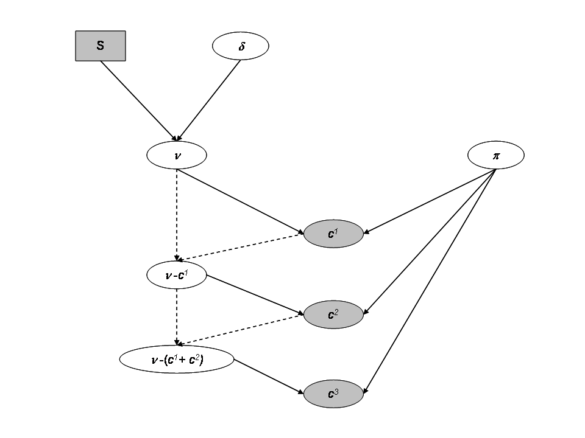
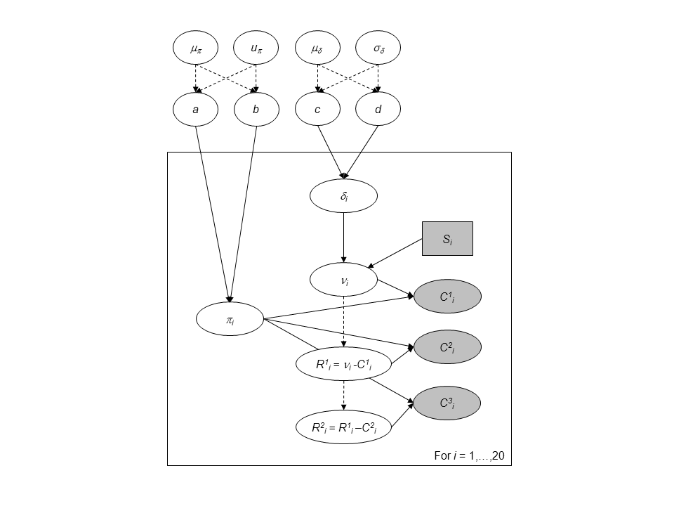
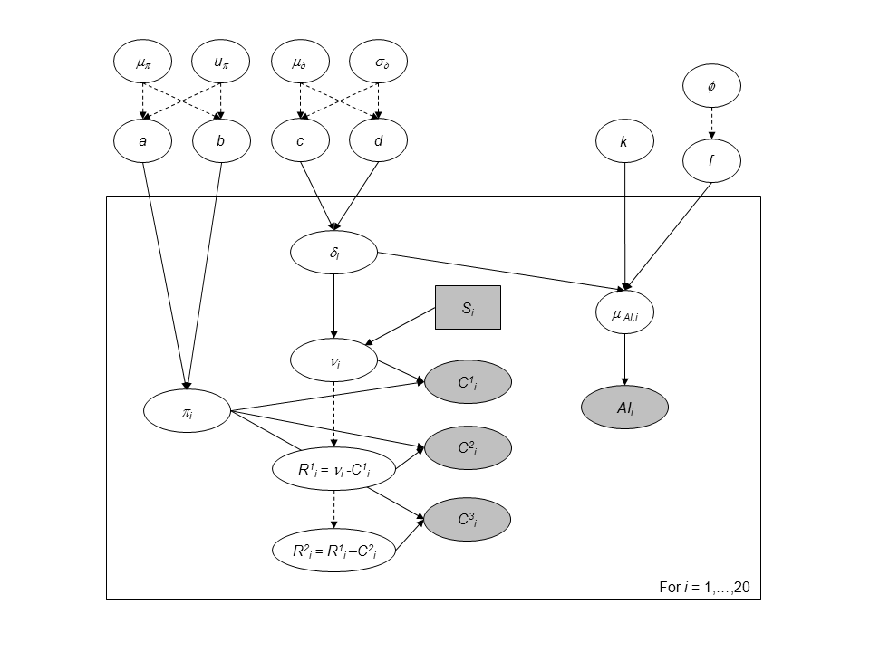

```{r, include = FALSE}
knitr::opts_chunk$set(
  collapse = TRUE,
  comment = "#>"
)
```

```{r setup, message=FALSE}
library(hbm4ecology)
library(rjags)
library(posterior)
library(tidyverse)
library(bayesplot)
library(GGally)
library(ggExtra)
```


The model rely on successive discrete (Binomial) distribution which the size parameter can get very low. This renders Normal approximation unreliable. Using `Stan` with Hamiltonian Monte Carlo would require to marginalize over the successive Binomial distribution. This requires some burdensome calculus. Hence we will use `jags` with a standard MCMC.

# Data and motivation

We turn to the successive removal Salmon data from the 
Nivelle, a 40-km river flowing from the Spanish Pyren\'{e}es to the bay of
Saint Jean de Luz. Details about the fishing procedure can be found in Chapter 
4.2 of @hbm4eco (page 83).
We work with a complete dataset involving 3 years (2003-2005) with 11 sites 
located from the Nivelle River mouth to impassable upstream dams on the main
stream and one of its tributaries. For each of the 33 experiments
the number of fish caught were recorded for the first ($C^{1}$),
second ($C^{2})$ and eventually third pass $(C^{3})$ of the
electrofishing experiment. In
addition, we provide the area
$S$ in $m^{2}$ that was fished each time.

<center>

{width=70% height=70%}

</center>

```{r data}
data("SucRemNivelle")
tibble(Site = seq(1,33)) %>% 
  bind_cols(bind_rows(SucRemNivelle[2:5])) %>% 
  knitr::kable(caption = "Three passes during successive removal electrofishing 
               on the Nivelle River (11 sites, years 2003-2004; NA = Not Available")
```


# Model with independence between sites

The sampling distribution of the catch data are for each site $i$:

* $C^1_i \sim Binomial(\nu_i, \pi_i)$
* $C^2_i \sim Binomial(\nu_i - C^1_i, \pi_i)$
* $C^3_i \sim Binomial(\nu_i - (C^1_i+C^2_i), \pi_i)$

Where we assume a Beta distribution for $\pi_i$:

* $\pi_i \sim beta(a,b)$, where we fix $a=b=1$ for uniform prior.

We consider that the population size $\nu_i$ depends on the expected fish density 
$\delta_i$ as the area $S_i$ of each sampling site is recorded. And we assume the 
fish to be randomly distributed in space within an infinitely large surface 
from which the site with finite surface $S$ is randomly picked. We further 
assign a prior distribution to the fish density $\delta_i$, via a Gamma 
distribution.
<!-- with a mean close to $1$ fish per $10$m$^2$ as currently proposed  -->
<!-- by biologists and a very large variance to allow for large uncertainty: -->

* $\nu_i \sim Poisson(\delta_iS_i)$
* $\delta_i \sim Gamma(c,d)$, with $c=d=1$.

<center>

{width=70% height=70%}

</center>

## Jags implementation and diagnostic for the independtent model

```{r indep_model}
ind_model_str <- "model
{

for (i in 1:I)
{

# Prior
# -----

# Prior on capture efficiency
	pi[i] ~ dbeta(1, 1)

# Prior on fish density
	delta[i] ~ dgamma(1, 1)

# Number of fish on each site i (surface S[i] in the data set)
	mu_nu[i] <- S[i] * delta[i]
	nu[i] ~ dpois(mu_nu[i]) T(,500)

# Likelihood
# ----------

	C1[i] ~ dbin(pi[i], nu[i])
	nur1[i] <- nu[i] - C1[i]
	C2[i] ~ dbin(pi[i], nur1[i])
	nur2[i] <- nur1[i] - C2[i]
	C3[i] ~ dbin(pi[i], nur2[i])

}

}"
```

<!-- ```{r ind-init} -->
<!-- ind_init <- list( -->
<!--   C3 = c( -->
<!--     NA, 1.0, 12.0, NA, 5.0, 3.0,9.0,17.0,1.0,3.0, -->
<!--     5.0, NA,1.0, NA,1.0, NA,0.0, NA,3.0,0.0, -->
<!--     1.0,5.0, NA,3.0, NA, 38.0,0.0,0.0,2.0,7.0, -->
<!--     17.0,0.0,0.0), -->
<!--   nu = c( -->
<!--     41.0,43.0,79.0,93.0,32.0, 41.0,97.0,149.0,96.0,35.0, -->
<!--     75.0,22.0,21.0,28.0,42.0, 42.0,33.0,65.0,40.0,38.0, -->
<!--     45.0,49.0,51.0,52.0,80.0, 296.0,61.0,25.0,86.0,143.0, -->
<!--     251.0,19.0,22.0), -->
<!--   delta = c( -->
<!--     0.06067,0.1387,0.1407,0.1789,0.09835, 0.2021,0.1396,0.2788,0.09932,0.1189, -->
<!--     0.1096,0.06569,0.02846,0.04362,0.05197, 0.166,0.175,0.09556,0.07486,0.0426, -->
<!--     0.1533,0.09649,0.0999,0.09703,0.1222, 0.2742,0.2165,0.1009,0.1384,0.2467, -->
<!--     0.3063,0.07111,0.03743), -->
<!--   pi = c( -->
<!--     0.6365,0.7319,0.4527,0.4956,0.5789, 0.6347,0.6508,0.6266,0.8438,0.501, -->
<!--     0.7697,0.6129,0.7505,0.3233,0.8757, 0.6493,0.8114,0.7924,0.6415,0.9126, -->
<!--     0.8147,0.5535,0.6124,0.7591,0.4126, 0.5203,0.9133,0.8758,0.8542,0.7182, -->
<!--     0.7681,0.8559,0.799)) -->
<!-- ``` -->

```{r fit-ind, cache=TRUE}
set.seed(123)
ind_model <- jags.model(file = textConnection(ind_model_str), 
                    data = SucRemNivelle, 
                 #   inits = replicate(3, ind_init, simplify = FALSE),
                    n.chains = 3)

# Inferences
update(ind_model, n.iter = 10000)
ind_posterior_sample <- coda.samples(ind_model,
                       variable.names = c("pi", "delta", "nu"),
                       n.iter = 10000,
                       thin = 10)
```


```{r}
diagnostic <- summarise_draws(as_draws_df(ind_posterior_sample),
                default_convergence_measures()) 
ggplot(diagnostic, aes(x = rhat)) +
  geom_histogram() +
  theme_classic(base_size = 15)
ggplot(diagnostic, aes(x = ess_bulk)) +
  geom_histogram() +
  theme_classic(base_size = 15)
```

We notice some convergence issues on sites with insufficient information (*e.g.* sites number 5, 10 or 26).

```{r trace-ind}
mcmc_trace(ind_posterior_sample, pars = c("delta[5]", "pi[5]", "delta[10]", "pi[10]"))
```

```{r df-ind}
dfw_ind <- extract_wider(ind_posterior_sample)
```


# Hierarchical modeling

We add a hierarchical additional layer that this the experiments together. We do 
so by adding prior distribution to $a$, $b$, $c$ and $d$. For the parameters 
$(a, b)$ we use a simple transformation by considering:

* $\mu_{a,b} = \frac{a}{a+b}$ with $\mu_{a,b} \sim Beta(1.5,1.5)$, which is the 
mean of the Beta distribution.
* $u_{a,b} = a+b$ with $\log(u_{a,b}) \sim Uniform(0,10)$ can be interpreted as 
a prior sample size that scales the variance of the Beta prior distribution.

We follow the same line of reasoning, a change of variable for parameters 
$c$ and $d$ with mean $\mu_{\delta} = \frac{c}{d}$ and standard deviation 
$\sigma_{\delta} = \frac{\sqrt{c}}{d}$. Prior knowledge about juvenile salmon 
density suggests  and informative prior for $\mu_{\delta}$ and a diffuse prior 
for $\sigma_{\delta}$:

* $\mu_{\delta} \sim Gamma(1,1)$
* $\sigma_{\delta} \sim Gamma(1, 10^{-3})$.

<center>

{width=70% height=70%}

</center>

## Jags implementation and diagnostic for the hierarchical model


```{r hier-model}
hier_model_str <- "model
{

# Priors
# ------

# Hyperprior for the trapping efficiency
mu_p ~ dbeta(1.5 ,1.5) 
log_u_p ~ dunif(0,10)
u_p <- exp(log_u_p)

a <- mu_p * u_p
b <- (1-mu_p) * u_p

# Compute standard deviation of p
var_p <- mu_p*(1-mu_p)*(1/(u_p+1))
sd_p <- sqrt(var_p)

# Hyperpriror for the density
mu_d ~ dgamma(1,1)
sd_d ~ dgamma(1,0.001)

# Parameterization of the Gamma distribution
c <- pow(mu_d,2) / pow(sd_d,2)
d <- mu_d / pow(sd_d,2)

for (i in 1:I)
{

# Prior on capture efficiency
	pi[i] ~ dbeta(a,b)

# Prior on fish density
	delta[i] ~ dgamma(c,d)

# Number of fish (S[i] in the data set)
	mu_nu[i] <- S[i] * delta[i]
	nu[i] ~ dpois(mu_nu[i]) T(,500)

}

# Likelihood
# ----------

for (i in 1:I)
{
	C1[i] ~ dbin(pi[i], nu[i])
	nur1[i] <- nu[i] - C1[i]
	C2[i] ~ dbin(pi[i], nur1[i])
	nur2[i] <- nur1[i] - C2[i]
	C3[i] ~ dbin(pi[i], nur2[i])
}

}
"

```


```{r fit-hier, cache=TRUE}
set.seed(123)
hier_model <- jags.model(
  file = textConnection(hier_model_str), 
  data = SucRemNivelle,
  n.chains = 3)

# Inferences
update(hier_model, n.iter = 10000)
hier_posterior_sample <- coda.samples(
  hier_model,
  variable.names = c("a", "b", "c", "d", "mu_d", "mu_p", 
                     "pi", "delta", "nu"),
  n.iter = 10000,
  thin = 10)
```

```{r}
summarise_draws(as_draws_df(hier_posterior_sample),
                default_convergence_measures()) %>%
  filter(variable %in% c("a", "b", "c", "d", "mu_d", "mu_p")) %>%  
  knitr::kable()
```


```{r trace-hier}
mcmc_trace(hier_posterior_sample, 
           pars = c("delta[5]", "pi[5]",
                    "delta[10]", "pi[10]"))
```


## Analysis

```{r}
dfw_hier <- extract_wider(hier_posterior_sample)

```

We draw the posterior distribution for the model parameters:

```{r}
dfw_hier %>% 
  select("a", "b", "c", "d", "mu_d", "mu_p") %>% 
  GGally::ggpairs(
  columnLabels = c("a", "b", "c", "d", "mu[delta]", "mu[pi]"),
  labeller = "label_parsed"
  ) +
  theme_linedraw(base_size = 15L, base_line_size = 0) +
  theme(axis.ticks = element_line(size = 15/22))
```

The expected efficiency of capture $\mu_{\pi}$ lies around $0.7$ and the $\pi$'s
are dispersed among sites approximately like a $Beta(7,3)$. We get a good
posterior knowledge about the expected density: $\mu_{\delta}$ is about $13$
individuals per 100$m^{2}$. In addition, one obtains a rather small standard
deviation $\sigma_{\delta}$ of fish densities among sites but, locally, the
densities $\delta_{i}$ 's are generally not precisely estimated.


The hierarchical model borrows strength from neighbors. Consequently the
problem of banana-shaped joint distribution between $\pi$ and $\delta$  is reduced when recourse 
is made to hierarchical modeling. As an example, when considered solely, site 5 and 10 exhibit
poor determination of $\pi$ and $\delta$ as shown in the figures below. The data at site 5 or 10 alone are
insufficient to opt for a large capture efficiency $\pi$ associated a small
population size or for a small capture efficiency with a high local population
density $\delta$. Under the hierarchical model though, sufficient transfer of
information between sites helps specify the probable joint domain where $\pi$
and $\delta$ are to be expected.


```{r}
p <- dfw_ind %>% 
  select(`pi.5`, `delta.5`) %>% 
  ggplot(aes(`delta.5`, `pi.5`)) +
  geom_point(col = "red") + 
  geom_density_2d(col = "black") +
  theme_bw(base_size = 15L, base_line_size = 0) +
  ylim(c(0,1)) +
  theme(legend.position="none")+
  labs(x=expression(delta),
       y=expression(pi),
       title="Fish density vs Capture efficiency at site 5",
       subtitle = "Independent model") 
ggExtra::ggMarginal(p, type = "densigram", bins = 40)
```

```{r}
p <- dfw_ind %>% 
  select(`pi.10`, `delta.10`) %>% 
  ggplot(aes(`delta.10`, `pi.10`)) +
  geom_point(col = "red") + 
  geom_density_2d(col = "black") +
  theme_bw(base_size = 15L, base_line_size = 0) +
  ylim(c(0,1)) +
  theme(legend.position="none")+
  labs(x=expression(delta),
       y=expression(pi),
       title="Fish density vs Capture efficiency at site 10",
       subtitle = "Independent model") 
ggExtra::ggMarginal(p, type = "densigram", bins = 40)
```


```{r}
phier <- dfw_hier %>% 
  select(`pi.5`, `delta.5`) %>% 
  ggplot(aes(`delta.5`, `pi.5`)) +
  geom_point(col = "red") + 
  geom_density_2d(col = "black") +
    ylim(c(0,1)) + xlim(c(0,0.3)) +
  theme_bw(base_size = 15L, base_line_size = 0) +
  theme(legend.position="none")+
  labs(x=expression(delta),
       y=expression(pi),title="Fish density vs Capture efficiency at site 5",
       subtitle = "Hierarchical model") 
ggExtra::ggMarginal(phier, type = "densigram", bins = 40)
  
```

```{r}
phier <- dfw_hier %>% 
  select(`pi.10`, `delta.10`) %>% 
  ggplot(aes(`delta.10`, `pi.10`)) +
  geom_point(col = "red") + 
  geom_density_2d(col = "black") +
    ylim(c(0,1)) + xlim(c(0,0.3)) +
  theme_bw(base_size = 15L, base_line_size = 0) +
  theme(legend.position="none")+
  labs(x=expression(delta),
       y=expression(pi),
       title="Fish density vs Capture efficiency at site 10",
       subtitle = "Hierarchical model") 
ggExtra::ggMarginal(phier, type = "densigram", bins = 40)
  
```


# Combining successive removals and a rapid sampling technique

Removal sampling by electric fishing is time and manpower consuming, because
it is difficult to store the removed fish and to go thrice in the field for a
large number of sites. To increase the number of sites sampled with limited
budget and diminishing human resources, recourse can be made to rapid electric
fishing assessment techniques. A 5-mn sampling technique requires a
single-timed sample for each site under a lighter protocol but only provides
relative abundance measures. To be used for absolute population abundance
estimation, abundance indices ($AI$) need ¨to be first calibrated with another
method of population size estimation. 

The $AI$'s
performed on the $33$ site of the dataset:

```{r data-AI}
knitr::kable(tibble(Site = 1:SucRemNivelle$I, AI = SucRemNivelle$AI))
```

To perform such a calibration in a consistent Bayesian framework, we need to model jointly successive removals and $AI$'s. There is a strong link between the observed abundance indices and the  mean of the posterior pdf
of $\delta$ that we take as an estimate of the fish density from each site.

```{r plot-10-17}
dfl_hier <- extract_longer(hier_posterior_sample) %>% mutate(Model = "Hierarchical")
df_delta_AI  <- dfl_hier %>% 
  filter(str_detect(parameter, "^delta\\.")) %>%
  rename("delta" = value) %>% 
  mutate(Site = as_factor(str_sub(parameter, 7))) %>% 
  group_by(Site) %>% 
  summarise(mean_delta = mean(delta)) %>% 
  mutate(abundance = SucRemNivelle$AI)
df_delta_AI %>% 
  ggplot(aes(x = abundance, y = mean_delta)) +
  ylim(c(0, .4)) + xlim(c(0, 70)) +
  geom_point() +
  xlab("Abundance indices") +
  ylab("Estimated fish density") +
  theme_classic(base_size = 15L) +
  labs(caption = "Posterior means of Salmon juvenile density (under hierarchical bayesian model) versus observed Abundance Indices.")
```

We can figure out a linear trend but with an increasing dispersion.
Conversely to the homoscedastic behavior of the linear regression model, the
variance should depend on the mean. Keeping these clues in mind, we relate the
vector of Salmon juveniles' density $\delta_{i}$'s to the vector of abundance
indices $AI_{i}$'s as follows:

* As we are counting events, we hypothesize for each site $i$, a Poisson
distribution for AI around a mean value $\mu_{AI}:$

\[ AI_{i}~\sim~Poisson(\mu_{AI_{i}}) \]

* In turn, this true mean value $\mu_{AI}$ will be drawn from a Gamma
distribution.

\[
\mu_{AI_{i}} ~ \sim~ Gamma(\alpha_{AI_{i}},\beta_{AI_{i}})
\]

Such a choice can be hypothesized for two reasons:

* The convolution of a Poisson by a Gamma distribution makes a negative
Binomial pdf, a common model for overdispersion in a
counting experiment;
* By setting $\beta_{AI_{i}}=f,\ \alpha_{AI{i}}=k\times f\times\delta_{i}%
$, one can describe a variance increasing (linearly) with the mean since:

\[
\left\{
\begin{aligned}
& \mathbb{E}(\mu_{AI_{i}}) = \frac{\alpha_{AI_{i}}}{\beta_{AI_{i}}}%
= k\delta_{i}\\
& \mathbb{V}(\mu_{AI_{i}}) = \frac{\alpha_{AI_{i}}}{\beta_{AI_{i}}^{2}}%
= \frac{     \mathbb{E}   (\mu_{AI_{i}})     }{f}
\end{aligned}
\right.
\]

\end{enumerate}

The additional parameters $k$ and $f$ must be assigned a prior pdf. Parameter
$k$ is given a flat noninformative gamma prior:
\[ k~\sim~Gamma(1,10^{-3}) \]
It is convenient to work with $\phi$ such that $F=\frac{\phi}{1-\phi}$. $\phi$ is the
probability parameter from the Negative Binomial and we naturally opt for a
uniform pdf:
\[ \phi ~ \sim~Beta(1,1) \]

<center>

{width=70% height=70%}

</center>

```{r model-AI, cache=TRUE}
ai_model_str <- "model
{

# Priors
# ------

# Hyperprior for the trapping efficiency
mu_p ~ dbeta(1,1) 
log_u_p ~ dunif(0,10)
u_p <- exp(log_u_p)

a <- mu_p * u_p
b <- (1-mu_p) * u_p

# Compute standard deviation of p
var_p <- mu_p*(1-mu_p)*(1/(u_p+1))
sd_p <- sqrt(var_p)

# Hyperpriror for the density
mu_d ~ dgamma(1,1)
sd_d ~ dgamma(1,0.001)

# Parameterization of the Gamma distribution
c <- pow(mu_d,2) / pow(sd_d,2)
d <- mu_d / pow(sd_d,2)

for (i in 1:I)
{

# Prior on capture efficiency
	pi[i] ~ dbeta(a,b)

# Prior on fish density
	delta[i] ~ dgamma(c,d)

# Number of fish (S[i] in the data set)
	mu_nu[i] <- S[i] * delta[i]
	nu[i] ~ dpois(mu_nu[i]) T(,500)

}

# Hyperpriors for the mean abundance index
k ~ dgamma(1, 0.001)
phi ~ dbeta(1, 1)
f <- phi/(1-phi)

# Priors for the Abundance index
for (i in 1:I) {
  alpha_AI[i] <- k*f*delta[i]
  mu_AI[i] ~ dgamma(alpha_AI[i], f)

}


# Likelihood
# ----------

for (i in 1:I) {
	C1[i] ~ dbin(pi[i], nu[i])
	nur1[i] <- nu[i] - C1[i]
	C2[i] ~ dbin(pi[i], nur1[i])
	nur2[i] <- nur1[i] - C2[i]
	C3[i] ~ dbin(pi[i], nur2[i])
  AI[i] ~ dpois(mu_AI[i])
  
}

# Predictive distribution of the density conditionnally upon
# observed abundance indices

for (i in 1:I_pred) {
  AI_pred[i] ~ dpois(mu_AI_pred[i])
  mu_AI_pred[i] ~ dgamma(alpha_AI_pred[i], f)
  alpha_AI_pred[i] <- k * delta_pred[i] * f
  delta_pred[i] ~ dgamma(c,d)
  # Link with observed abundance indices
}

}
"

```


```{r fit-AI, cache=TRUE}
set.seed(123)
ai_model <- jags.model(file = textConnection(ai_model_str), 
                    data =SucRemNivelle,#c(dataList$value, data_AI),
                    n.chains = 3)

# Inferences
update(ai_model, n.iter = 10000)
ai_posterior_sample <- coda.samples(
  ai_model,
  variable.names = c("a", "b", "c", "d", "mu_d", "mu_p", "sd_d", "sd_p",
                     "pi", "delta", "nu", "phi", "k", "f", "mu_AI", 
                     "delta_pred", "mu_AI_pred"),
  n.iter = 10000,
  thin = 10)
```

```{r}
summarise_draws(as_draws_df(ai_posterior_sample),
                default_convergence_measures()) %>%
  filter(variable %in% c("a", "b", "c", "d", 
                         "mu_d", "mu_p", "sigma_d", "sigma_p",  
                         "phi", "k", "mu_AI")) %>%  
  knitr::kable()
```


```{r trace-ai}
mcmc_trace(ai_posterior_sample, 
           pars = c("delta[5]", "pi[5]",
                    "delta[10]", "pi[10]"))
```


## Results and analysis

```{r plot-10-13, fig.retina=4}
dfw_ai <- extract_wider(ai_posterior_sample)
dfw_ai %>% 
  select("mu_d", "sd_d", "mu_p",  "sd_p", "phi", "k") %>% 
  GGally::ggpairs(
  columnLabels = c("mu[delta]", "sigma[delta]", "mu[pi]",  "sigma[pi]", "phi", "k"),
  labeller = "label_parsed",
  lower = list(continuous = wrap("points", alpha = 0.3,size = .5))
  ) + 
  theme_linedraw(base_size = 15L, base_line_size = 0) +
  theme(axis.ticks = element_line(size = 15/22)) + 
  labs(caption = "Posterior distributions of parameters for the full AI + successive removal model.")
```

The statistical Bayesian learning machinery provides informative posterior
distribution for $\phi$ and $k$:

* $\phi$ is far from uniform, its posterior pdf varies around $0.65$
* $k$ varies close to $150$ with a small standard deviation


```{r long-df}
dfl_ind <- extract_longer(ind_posterior_sample) %>%  mutate(Model = "Independent")
dfl_ai <- extract_longer(ai_posterior_sample) %>%  mutate(Model = "Abundance Index")
```


```{r plot-10-14}
bind_rows(dfl_hier, dfl_ind, dfl_ai) %>% 
  filter(str_detect(parameter, "^delta\\.")) %>%
  rename("delta" = value) %>% 
  mutate(Site = as_factor(str_sub(parameter, 7))) %>%  # 7 = length("delta.") + 1
  ggplot() +
  aes(x = Site, y = delta, fill = Model ) +
  geom_boxplot(outlier.shape = NA, outlier.size = .25) +
  scale_x_discrete(guide = guide_axis(angle = 90)) +
  ylim(c(0,0.75)) +
  scale_fill_manual(values = c("gray10", "gray50", "gray90")) +
  ylab("Fish density") +
  theme_classic(base_size = 15L) +
  labs(caption = expression("Marginal posterior distributions of salmon densities delta for each site index."))
```

The figure makes clear the shrinkage effect due
to hierarchical modeling: with the hierarchical model, the densities are less
dispersed around the grand mean. Sharing information between
sites allows for more precise estimations of the local fish densities.
The black boxplotsdepict the posterior pdf of fish density $\delta$ when modeling
jointly the successive removals and the $AI$'s. 
When compared to the previous model without taking into account
the information conveyed by the abundance index (grey boxplots), we see that
there is only a small shrinkage effect: although the 50% credible intervals
are generally narrower, *i.e.*, we learn something from the $AI$ sample
but not that markedly. Site $26$ bears a noticeable exception that can be
explained by contradictory information brought by successive removals and by
AI. If we were to trust the successive removal model only, the juvenile
density for site $26$ should be around $0.3$ and, as $k$ is close to $140$, we
should expect a value of $150\times0.3=45$ individuals for the abundance
index, but we actually observed $63$ juveniles in the $AI$ data!

```{r}
dfl_ai %>% 
  filter(str_detect(parameter, "^delta_pred.")) %>%
  mutate(AI = as.numeric(str_sub(parameter, 12))) %>% 
  rename("delta_pred" = value) %>% 
  group_by(AI) %>% 
  summarise(qs = quantile(delta_pred, 
                          c(.1, .25, .5, .75, .9)),
                          prob = c(.025, .25, .5, .75, .975)) %>% 
  pivot_wider(names_from = prob, values_from =  qs) %>% 
  ggplot(aes(x = AI, y = `0.5`)) +
  geom_ribbon(aes(ymin = `0.025`, ymax = `0.975`), fill = "gray50") +
  geom_ribbon(aes(ymin = `0.25`, ymax = `0.75`), fill = "gray75") +
  geom_line() +
  geom_point(data = df_delta_AI,
  mapping = aes(x = abundance, y = mean_delta)) +
  xlab("Abundance indices") +
  ylab("Posterior predictive of fish density") +
  theme_classic(base_size = 15L) +
  labs(caption = "Predictive posterior distribution of Salmon juvenile density versus Abundance Indices (50% and 95% credible interval)")

```

The figure 
shows that the index of abundance alone allows for differentiation between
contrasting levels of fish density without recourse to the successive removal
technique in the future. Yet fairly imprecise, this rapid sampling technique
also provides the corresponding confidence bounds that match the cloud made by
the posterior means of Salmon juvenile density (under the HBM model) and the
Abundance Indices observed in the dataset.
