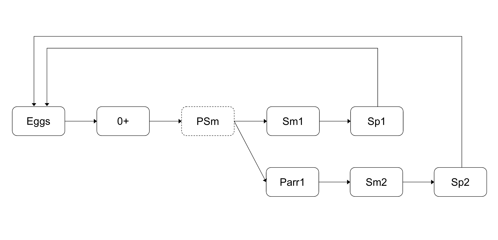
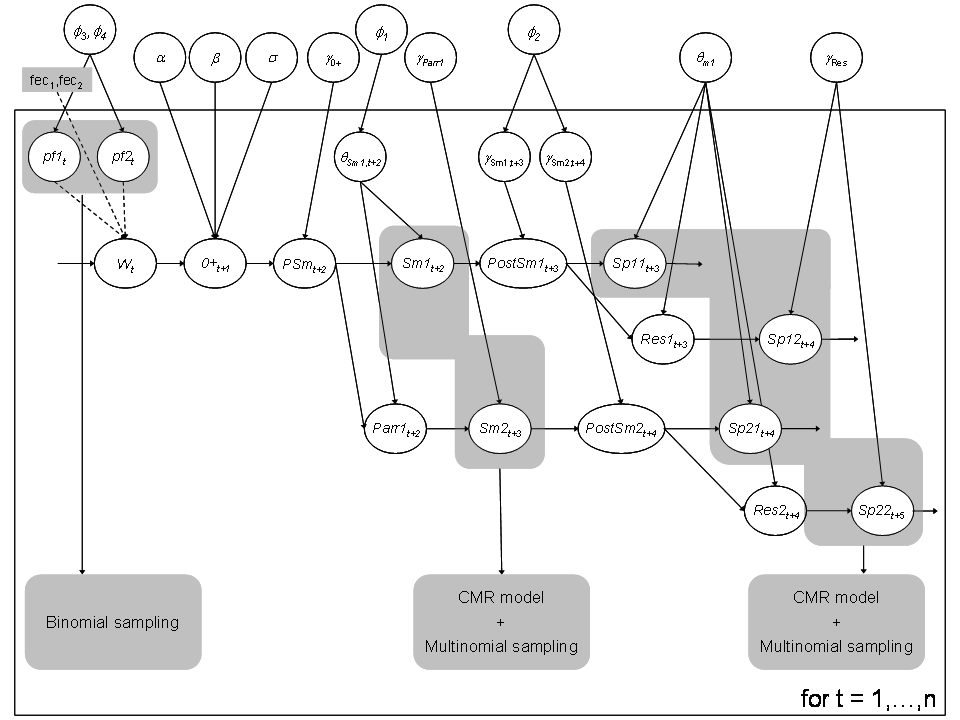

```{r, include = FALSE}
knitr::opts_chunk$set(
  collapse = TRUE,
  comment = "#>"
)
```

```{r setup, results=FALSE, message=FALSE}
library(hbm4ecology)
library(rjags)
library(posterior)
library(tidyverse)
library(bayesplot)
plot_theme <-  theme_classic(base_size = 15L) + 
  theme(axis.text.x =  element_text(angle = 90),
        strip.background = element_rect(fill = "#618288"),
        strip.text = element_text(size = 15))
```

# Motivation and context

We illustrate the flexibility of the Bayesian state-space
modeling approach for stage-structured population dynamics models fitted to
series of sequential observations of different nature. The example is inspired
from @RivotPrevostParent04.

The method is applied to a fully stage-structured model for the Atlantic
salmon life cycle with multiple life histories. The model describes the
dynamics of the numbers of individuals at various life stages, with a discrete
annual time step. It includes nonlinear regulation and has a probabilistic
structure accommodating for both environmental and demographic stochasticity.
The model is fitted to a dataset resulting from the comprehensive survey of
the salmon population of the Oir River (Lower Normandy, France) between 1984
and 2001. Observation models are constructed to relate the field data to the
hidden states at the various life stages. The observation process corresponds
essentially to capture-mark-recapture (CMR) experiments for the evaluation of
migrating juvenile and spawner runs and random sampling for demographic
features. 

We take into consideration a detailed description of A. salmon life histories: 
fish from the two smolt age classes (1+ Smolts and 2+ Smolts) can either spend 
one or two winters at sea (1SW and 2SW in the following) before returning as
spawners. One and two sea winter spawners resulting from 1+ Smolts are denoted
$Sp11$ and $Sp12$, respectively, and those issued from 2+ Smolts are
denoted $Sp21$ and $Sp22$, respectively. Both $Sp11$ and $Sp21$ are
1SW fish but with different smolt-ages, and $Sp12$ and $Sp22$ are
2SW fish with different smolt-ages.


<center>

{width=80% height=80%}

</center>

# Modeling

Here we adopt a slightly simplified model than the one described 
in the corresponding chapter of the book (Chap. 11.3, @hbm4eco).

## Process equations describing the hidden population dynamics


1. Spawner --> Eggs
    - The number of eggs laid by female in year $t$ is a deterministic function of the number of spawners, the proportion of females and the fecondity rate:
\[ W_t = (Sp11_t + Sp21t - y^{Sp}_{2,t}) \times pf_{1,t} \times fec_1 + (Sp12_t + Sp22t - y^{Sp}_{3,t}) \times pf_{2,t} \times fec_2\]
with the following distributions:

  - $y^2_{Sp}$ and $y^3_{Sp}$ are known number of fish removed.
  - $Sp21_{t=1} \sim Uniform(1, 50)$ spawners issued from 1+ smolts
  - $Sp12_{t=1} \sim Uniform(1, 50)$ spawners issued from 2+ smolts
  - $fec_1$ and $fec_2$ are the mean fecondity of female which is known and constant over time
  - $pf_{1,t}$ and $pf_{2,t}$ are the proportion of female among 1SW and 2SW fish.

2. Eggs --> 0+ juveniles

We model this with a density dependent Ricker relationship, with lognormal error 
to represent the environmental variability:
\[ 0+_{t+1}^* \sim Normal(\log(W_t^* \times \alpha \times e^{-\beta\times W_{t}^*}), \sigma^2) \]
$0+_{t}^* = 0+_t/h$ and $W_{t}^* = W_t/h$ are standardized by the surface area of habitat available for juveniles production $h = 25229m^2$. And we give the following prior distributions:

  - $\log(\alpha) \sim Uniform(-10,10)$
  - $\beta \sim Normal (0,100)$
  - $\log (\sigma^2) \sim Uniform(-20,20)$

3. 0+ juveniles --> Smolts

The juveniles $0+_{t+1}$ will survive to next spring as pre-smolts $PSm_{t+2}$ 
with probability $\gamma_{0+}$. Here, we use an approximation of 
$PSm_{t+2} \sim Binomial(0+_{t+1}, \gamma_{0+}$ by saying that a fixed rate 
$\gamma_{0+}$ of juveniles will survive. We will make a similar approximation for 
all the survival and migration steps.

  * $PSm_{t+2} = \gamma_{0+}\times 0+_{t+1}$
  * $\gamma_{0+} \sim Beta(15, 15)$

Among pre-smolts a proportion $\theta_{Sm1, t+2}$ will migrate as $1+$ Smolts 
while the remaining will stay an additional year as $1+$ Parrs, which will 
survive and migrate next year with probability $\gamma_{parr1}$. 
Again we use a deterministic approximation for the binomial:

  - $Sm1_{t+2} = PSm_{t+2} \times  \theta_{Sm1, t+2}$
  - $Parr1_{t+2} = PSm_{t+2} - Sm1_{t+2}$
  - $Sm2_{t+3} = Parr1_{t+2} \times \gamma_{parr1}$
  


4. Smolts --> Returning spawners 

A proportion $\gamma_{Sm1, t+2}$ of 1+ Smolts will survive the first winter at 
sea and will become post-smolts. Then among these post-smolts, a proportion 
$\theta_{m1}$ will mature as sea-winter fish $Sp11$ the next summer, while the 
rest will not mature this year ($Res1$).

  - $PostSm1_{t+3} = Sm1_{t+2} \times \gamma_{Sm1, t+2}$ 
  - $Sp11_{t+3} =  PostSm1_{t+3} \times \theta_{m1}$ 
  - $Res1_{t+3} = PostSm1_{t+3} - Sp11_{t+3}$ 


Also for year $t +4$:

  - $Sp12_{t+4} = Res1_{t+3} \times \gamma_{res}$
  - $PostSm2_{t+4} = Sm2_{t+2} \times \gamma_{Sm2, t+3}$
  - $Sp21_{t+4} = PostSm2_{t+4} \times \theta_{m1}$
  - $Res2_{t+4} = PostSm2_{t+4} - Sp21_{t+4}$

and year $t + 5$:

  - $SP22_{t+5} = Res2_{t+4} \times \gamma_{res}$


Finally the number of spawners in year $t$ is obtained by the mass balance equation:
\[Sp_t = Sp11_t + Sp12_t + Sp21_t + Sp22_t\]

### Initial state variable

We give the following prior distribution at $t=1$ for the fish population at 
different stages of the life cycle:

  - $0+_{t=1}^* \sim Uniform(0,1)$
  - $PSm_{t=1} \sim Uniform(1,10000)$
  - $Sm2_{t=1} \sim Uniform(0,300)$
  - $PostSm1_{t=1} \sim Uniform(0,1000)$
  - $PostSm2_{t=1} \sim Uniform(0,1000)$
  - $Sp12_{t=1}^* \sim Uniform(0,100)$
  - $Sp21_{t=1}^* \sim Uniform(0,50)$

## Modeling the priors on vital rates trough an exchangeable hierarchical structures


The model encompasses both demographic and environmental
stochasticity by allowing an interannual random variability of the
proportion of smolts migrating as 1+ Smolts and the marine survival
rate of post-smolts. Interannual random variations are modeled
through an exchangeable hierarchical
structure [@gelman+2004], by assuming
that the parameters of all years $t$ are randomly drawn from the
same probability distribution conditioned by unknown parameters
common to all years. Hierarchical structures allow to
probabilistically share information among the different years and
can improve the estimation of key parameters
(@McAllister+2004; @MichielsenMcAllister04;
@RivotPrevost02). Here, an exchangeable hierarchical structure
is used to mimic a between-year variability that is assumed to be
random, without any particular time trends or covariates
(*i.e.*, climate) to explain the variations.


An exchangeable hierarchical structure is used to capture the
between-year variability of the probability for a pre-smolt to
smoltify as 1+ smolt. The
$logit$-transform of the $\theta_{Sm1,t}$'s are a priori drawn in a
Normal distribution with mean and variance parameters
$\phi_{1}=(\mu_{\theta_{Sm1}},\sigma_{\theta_{Sm1}})$ shared between
years. The $\theta_{Sm1,t}$'s are then calculated by the inverse
transformation $logit^{-1}$:

  - $logit(\theta_{Sm1,t}) \sim Normal(\mu_{\theta_{Sm1}},\sigma_{\theta_{Sm1}})$


The same procedure was applied for the survival rate of one year
river-aged post-smolts, $\gamma_{Sm1,t}$. The
survival rates of two year river-aged post-smolts, $\gamma_{Sm2,t}$,
are defined based on the reasonable a priori constraint that the
survival rate of two year river-aged post-smolts is always greater
than for one year river-aged post-smolts, but with the same time
variations. This constraint is specified in the $logit$ scale.

  - $logit(\gamma_{Sm1,t}) \; \sim \; Normal(\mu_{\gamma_{Sm1}},\sigma_{\gamma_{Sm1}})$
  - $logit(\gamma_{Sm2,t}) \; = \; logit(\gamma_{Sm1,t}) + \delta_{\gamma}$, $\delta_{\gamma} \geq 0$
  
Finally, the $logit$-transform of the proportions of females in 1SW and 2SW
fish, $pf1_{t}$ and $pf2_{t}$ are a priori independently drawn in Normal
distributions with mean and variance parameters shared between years:

  - $logit(pf1_{t}) \; \sim \; Normal(\mu_{pf1},\sigma_{pf1})$
  - $logit(pf2_{t}) \; \sim \; Normal(\mu_{pf2},\sigma_{pf2})$

Informative beta distributions\index{distribution!Beta} based on prior ecological expertise are set for
$\gamma_{0+}$ (survival rates of 0+ Juveniles) and $\gamma_{Parr1}$ (survival
rate of 1+ Parrs), with mean $0.5$ and $0.66$, respectively. All the remaining
parameters of the population dynamics are considered constant over time with
rather diffuse prior distribution.

Where we give the following prior distributions:

We give the following prior distributions for the survival and migration rates:

  - $\theta_{m1} \sim Beta(3,2)$
  - $\gamma_{res} \sim Beta(3,2)$
  - $\gamma_{parr1} \sim Beta(20,10)$
  - $\mu_{\theta_{Sm1}} \sim Uniform(0, 100)$ and $\sigma_{\theta_{Sm1}} \sim Uniform(0, 5)$
  - $\mu_{\theta_{Sm1}} \sim Uniform(0, 100)$ and $\sigma_{\theta_{Sm1}} \sim Uniform(0, 5)$
  - $\mu_{pf1} \sim Normal(0,100)$ and $\sigma_{pf1} \sim Uniform(0,5)$
  - $\mu_{pf1} \sim Normal(0,100)$ and $\sigma_{pf2} \sim Uniform(0,5)$

<center>

{width=80% height=80%}

</center>

## Data and observation equations

Let first have a glimpse of the data:

```{r}
glimpse(SalmonLifeCycle)
```

Capture-mark-recapture and sampling data for smolts at the downstream trap by migration year ($y_i^{Sm}$, $i = 1, \dots, 5)$:

```{r}
knitr::kable(bind_cols(SalmonLifeCycle[c(5, 21:25)]))
```

Capture-mark-recapture and sampling data for spawners at the upstream trap by migration year ($y_i^{S}$, $i = 1, \dots, 6)$:

```{r}
knitr::kable(bind_cols(SalmonLifeCycle[c(5, 6:11)]))
```

Capture-mark-recapture and sampling data for spawners at the upstream trap by migration year ($y_i^{S}$, $i = 7, \dots, 15)$ (continued):

```{r}
knitr::kable(bind_cols(SalmonLifeCycle[c(5, 12:20)]))
```


The observations (1984 - 2001) have been gathered under an
homogeneous experimental design and few data are missing. Each
annual survey provides two complementary sources of information, the
number of smolts and spawners in each annual run, and the
demographic structure (age classes and sex-ratio) in smolts and
adult runs.

## Updating the population size at the various life stages

Available information to estimate the size of smolt and spawner runs
does not distinguish between the age classes. For both the smolts
and the spawners, a proportion of the migrating population is
captured at a partial counting fence and marked for further
recapture. CMR experiments provide
data to update the total number of smolts migrating in year $t$, 
$Sm_{t} = Sm1_{t}+Sm2_{t}$, and the total number of spawners returning in
year $t$, $Sp_{t}=Sp11_{t}+Sp12_{t}+Sp21_{t}+Sp22_{t}$.


### Smolt run

<center>

{width=80% height=80%}

</center>

CMR experiments for smolts are analogous to the two-stage Petersen experiment
(\cite{Seber1982}). For each year $t$ between 1986 and 2001, let us denote
$y_{1,t}^{Sm}$ the number of smolts caught in the downstream trapping facility
during the migration time. Among the $y_{1,t}^{Sm}$ smolts captured, a number
$y_{2,t}^{Sm}$ have been tagged and released upstream from the trapping
facility used for capture. Some of these
tagged and released smolts, denoted $y_{3,t}^{Sm}$ ($y_{3,t}^{Sm}<y_{2,t}%
^{Sm}$), will be recaptured at the same downstream trap. The capture and
recapture data for each year $t$ can be modeled by two successive Binomial
distributions with the same capture probabilities $\pi_{t}^{Sm}$ (interpreted
as the trapping efficiency that may vary between years):

  - $y^{Sm}_{1,t} \; \sim \; Binomial(Sm_{t},\pi^{Sm}_{t})$ 
  - $y^{Sm}_{3,t} \; \sim \; Binomial(y^{Sm}_{2,t},\pi^{Sm}_{t})$ 

Intuitively, the second Binomial equation will contribute to specify the
trapping efficiency $\pi_{Sm,t}$, while the first one brings information to
update the total number of downstream migrating smolts $Sm_{t}$.

### Spawner run

Conversely to smolts, CMR
experiments for spawners cannot be assimilated to a simple Petersen
experiment. For each year $t$ from $1984$ to $2001$, $y_{1,t}^{Sp}$
denotes the number of fish trapped at the counting fence. Among these 
$y_{1,t}^{Sp}$ fish, $y_{2,t}^{Sp}$ one sea-winter and $y_{3,t}^{Sp}$ two
sea-winter fish are removed from the population. A number $y_{4,t}%
^{Sp}=y_{1,t}^{Sp}-(y_{2,t}^{Sp}+y_{3,t}^{Sp})$ of fish are tagged and
released upstream from the trap. The recapture sample is gathered during and
after spawning by three methods (electrofishing on the spawning grounds,
collection of dead fish after spawning, and trapping of spent fish at the
downstream trap). Let us denote as $y_{5,t}^{Sp}$ and $y_{6,t}^{Sp}$ the
number of marked and unmarked fish among recaptured fish, respectively.


  - $y^{Sp}_{1,t} \; \sim \; Binomial(Sp_{t},\pi^{Sp,1}_{t})$ 
  - $y^{Sp}_{5,t} \; \sim \; Binomial(y^{Sp}_{4,t},\pi^{Sp,2}_{t})$ 
  - $y^{Sp}_{6,t} \; \sim \; Binomial(Sp_{t}-y^{Sp}_{1,t},\pi^{Sp,2}_{t})$ 

The reasoning underlying how the information contained in the data
is used in the three lines is as
follows: the second line essentially conveys information to estimate
the recapture probability $\pi _{t}^{Sp,2}$. Both the third and the
first line carry information on the total number of spawners
$Sp_{t}$.

### Hierarchical prior on the trapping efficiencies

The between-year variability of the probabilities of capture
$\pi_{t}^{Sm}$, $\pi_{t}^{Sp,1}$ and $\pi_{t}^{Sp,2}$ is modeled
through exchangeable hierarchical structures with hyper-parameters
denoted $\phi_{Sm}$, $\phi_{Sp,1}$ and $\phi_{Sp,2}$ respectively.
Instead of drawing the $\pi$'s in beta distributions, the $logit$-transform
of the $\pi$'s are drawn from Normal distributions with mean and
variance parameters shared between years. The $\pi$'s are then
calculated by the inverse transformation $logit^{-1}$.

  - $logit(\pi^{Sm}_{t})    \; \sim \; Normal(\mu_{\pi_{Sm}},\sigma_{\pi_{Sm}})$  
  - $logit(\pi^{Sp,1}_{t}) \; \sim \; Normal(\mu_{\pi_{Sp,1}},\sigma_{\pi_{Sp,1}})$
  - $logit(\pi^{Sp,2}_{t}) \; \sim \; Normal(\mu_{\pi_{Sp,2}},\sigma_{\pi_{Sp,2}})$ 
  
We set diffuse prior distribution on the parameters of the Normal distributions:

  - $\mu_{\pi_{Sm}} \sim Normal(0,100)$ and $\sigma_{\pi_{Sm}} \sim Uniform(0,5)$
  - $\mu_{\pi_{Sp,1}} \sim Normal(0,100)$ and $\sigma_{\pi_{Sp,1}} \sim Uniform(0,5)$
  - $\mu_{\pi_{Sp,2}} \sim Normal(0,100)$ and $\sigma_{\pi_{Sp,2}} \sim Uniform(0,5)$  

## Updating the demographic structure

In addition to the CMR data, sampling among the fish caught at the
trap enables us to update the yearly proportions of the age classes
in the smolt and spawner runs $Sm_{t}$ and $Sp_{t}$, and the mean
sex ratio in the spawner run.  For each demographic feature,
sampling is modeled by independent Binomial or multinomial
processes.

### River age in smolt run

$y^{Sm}_{4,t}$ denotes the sample size of smolts examined for river-age in the
run of year $t$ and $y^{Sm}_{5}$ is the number of 1+ Smolts among them. The
proportion of 1+ Smolts in year $t$, denoted $\rho_{Sm1,t}$ is updated by
modeling $y^{Sm}_{5}$ as the result of a Binomial sampling with a sample size
$y^{Sm}_{4,t}$ and a probability $\rho_{Sm1,t}$:

  - $\rho_{Sm1,t} = \frac{Sm1_{t}}{Sm1_{t} + Sm2_{t}}$
  - $y^{Sm}_{5,t} \; \sim \; Binomial(y^{Sm}_{4,t},\rho_{Sm1,t})$


### Sea and River-age in spawner run

$y_{7,t}^{Sp}$ denotes the sample size of spawners examined for sea
and river-age in the run of year $t$. $y_{8,t}^{Sp}$ and
$y_{9,t}^{Sp}$ are the number of 1SW fish resulting from 1+ and 2+
Smolts, respectively among $y_{7,t}^{Sp}$, and $y_{10,t}^{Sp}$ and
$y_{11,t}^{Sp}$ are the number of 2SW fish issued from 1+ and 2+
Smolts, respectively among $y_{7,t}^{Sp}$. The proportions of the
four different age classes in each spawning run (summing to
$1$) are updated through a multinomial model:

  - $ \rho_{Sp,t} = (\frac{Sp11_{t}}{Sp_{t}} , \frac{Sp21_{t}}{Sp_{t}}, \frac{Sp12_{t}}{Sp_{t}}, \frac{Sp22_{t}}{Sp_{t}})$ 
  - $(y^{Sp}_{8,t},y^{Sp}_{9,t},y^{Sp}_{10,t},y^{Sp}_{11,t}) \; \sim \; Multinomial(y^{Sp}_{7,t},\rho_{Sp,t})$


### Sex ratio in spawner run

Sex-ratio in spawner runs are updated each year $t$ through Binomial sampling
experiments considered independent for one and two sea-winter fish. Each year
$t$, $y^{Sp}_{12,t}$ 1SW fish (resp. $y^{Sp}_{14,t}$ 2SW fish) are examined
for sex identification and $y^{Sp}_{13,t}$ (resp. $y^{Sp}_{15,t}$) are
identified as females among them. Proportion of females in the two sea-age
classes $pf_{1,t}$ and $pf_{2,t}$ are updated through Binomial sampling:


  - $ y^{Sp}_{13,t}  \sim  Binomial(y^{Sp}_{12,t},pf_{1,t})$ 
  - $ y^{Sp}_{14,t}  \sim  Binomial(y^{Sp}_{15,t},pf_{2,t})$


# Model estimation

We will remove the data from 1984 and 1985 as there are missing data (`NA`).

```{r}
data <- SalmonLifeCycle
data$n <-  16
data[c(5:25)] <- bind_cols(SalmonLifeCycle[c(5:25)]) %>% filter(Year >= 1986) %>% as.list()
data$sample_Sp <- bind_cols(data[13:16])

```


```{r model}
model_str <- "
model {
# ---------------------------------------------------------------------------
#                               PRIORS	
# ---------------------------------------------------------------------------

# Priors for Ricker stock-recruitmnt parameters
# R = alpha*exp(-beta*S)
# alpha constrained <1 becasue it is a survival rate eggs --> 0+

	log.alpha ~ dunif(-10,0)		
	alpha <- exp(log.alpha)
	beta ~ dnorm(0,0.01)
	exp.beta <- exp(beta)
	
# Prior for recruitment process error variance
# (Corresponds to approximative 1/V between 1E-6 and 1E+6)

	log.sigma_2 ~ dunif(-13.8,13.8)
	sigma_2 <- exp(log.sigma_2)
	tau <- 1/sigma_2

# Survival rate Juveniles 0+ --> Pre-smolts1 (constant between years)

	s01 ~ dbeta(15,15)

# Life history choice - probability to migrate as Smolt 1
# (exchangeable hierarchical structure between years)

	mu_theta_Sm1 ~ dnorm(0,0.01)
	sd_theta_Sm1  ~ dunif(0,5)
	tau_theta_Sm1 <- 1/(sd_theta_Sm1*sd_theta_Sm1)
	# Indice [n+1] is the predictive
	for( i in 1:(n+1) ) 	{
	logit_theta_Sm1[i] ~ dnorm(mu_theta_Sm1,tau_theta_Sm1)
	logit(theta_Sm1[i]) <- logit_theta_Sm1[i]			}

# Survival rate Parr 1+ resident --> Smolts 2 (constant between years)

	s12 ~ dbeta(20,10)

# Transition Smolt1 --> post-smolts (survival during the first year at sea)
# (exchangeable hierarchical structure between years)

	mu_ss11 ~ dnorm(0,0.01)
	sd_ss11 ~ dunif(0,5)
	tau_ss11 <- 1/(sd_ss11*sd_ss11)
	# Indice [n+1] is the predictive
	for( i in 1 : (n+1) ) 	{
	logit_ss11[i] ~ dnorm(mu_ss11,tau_ss11)
	logit(ss11[i]) <- logit_ss11[i]
	logit(ss21[i]) <- logit_ss11[i] + delta_ss1	}

# Differential in survival rate between Sm1 and Sm2 (constant between years)
# logit(ss21) = logit(ss11) + delta_ss1

	delta_ss1 ~ dunif(0,10)

# Proportion of maturing adults as 1SW (constant between years)
	
	theta_m1 ~ dbeta(3,2)

# Marine survival rate for non maturing 1SW post-smolts
# Survival probability is the same for non maturing post.smolts1 and post.smolts2 
# (ss12 = ss22) and constant accross year

	ss2 ~ dbeta(3,2)

# Proportion of females pf1 and pf2 (exchangeable hierarchical structure between years)
	
	mu_pf1 ~ dnorm(0,0.01)
	sd_pf1 ~ dunif(0,5)
	tau_pf1 <- 1/(sd_pf1*sd_pf1)

	mu_pf2 ~ dnorm(0,0.01)
	sd_pf2 ~ dunif(0,5)
	tau_pf2 <- 1/(sd_pf2*sd_pf2)

	# Indice [n+1] is the predictive
	for( i in 1 : (n+1) ) 	{
	logit_pf1[i] ~ dnorm(mu_pf1,tau_pf1)
	logit(pf1[i]) <- logit_pf1[i]
	logit_pf2[i] ~ dnorm(mu_pf2,tau_pf2)
	logit(pf2[i]) <- logit_pf2[i]		}

#  Trapping efficiencies (exchangeable hierarchical structure between years)

	# Smolts
	mu_pi_sm ~ dnorm(0,0.01)
	sd_pi_sm ~ dunif(0,5)
	tau_pi_sm <- 1/(sd_pi_sm*sd_pi_sm)
	
	# Adults
	mu_pi_sp1 ~ dnorm(0,0.01)
	sd_pi_sp1 ~ dunif(0,5)
	tau_pi_sp1 <- 1/(sd_pi_sp1*sd_pi_sp1)
	
	# Adults recapture efficiency
	mu_pi_sp2 ~ dnorm(0,0.01)
	sd_pi_sp2 ~ dunif(0,5)
	tau_pi_sp2 <- 1/(sd_pi_sp2*sd_pi_sp2)

	# Indice [n+1] is the predictive
	for( i in 1 : (n+1) ) 	{
	# Smolts
	logit_pi_sm[i] ~ dnorm(mu_pi_sm,tau_pi_sm)
	logit(pi_sm[i]) <- logit_pi_sm[i]
	
	# Adults
	logit_pi_sp1[i] ~ dnorm(mu_pi_sp1,tau_pi_sp1)
	logit(pi_sp1[i]) <- logit_pi_sp1[i]
	
	# Adults recapture efficiency
	logit_pi_sp2[i] ~ dnorm(mu_pi_sp2,tau_pi_sp2)
	logit(pi_sp2[i]) <- logit_pi_sp2[i]		}


# ---------------------------------------------------------------------------
#           PROCESS EQUATIOnS (hidden population dynamics)
# ---------------------------------------------------------------------------

# Prior on states for the first year
	dSp12 <- rep(1, 100)
	dSp22 <- rep(1, 50)
	
	Sp12[1] ~ dcat(dSp12)
	Sp22[1] ~ dcat(dSp22)
	
	dSm2 <- rep(1, 300)
	
 	Sm2[1] ~ dcat(dSm2)
	
	Jint[1] ~ dunif(0,1)

  dPSm <- rep(1, 10000)
	PSm[1] ~ dcat(dPSm)

	dPostSm1 <- rep(1, 1000)
	dPostSm2 <- rep(1, 1000)	
	post.smolt1[1] ~ dcat(dPostSm1)
	post.smolt2[1] ~ dcat(dPostSm2)

#  Loop on time series (n = 18, i = 1 is year 1984, i = n is year 2001)

for( i in 1 : n ){
	
	Sp1[i] <- Sp11[i] + Sp21[i]
	Sp2[i] <- Sp12[i] + Sp22[i]
	Sp[i] <- Sp1[i] + Sp2[i]
	
# Stock (eggs) : number of female = marked and released + escape from the trap
# Standardized per m² of wetted production area

	Eggs[i] <- max( ( (Sp1[i]-x_Sp1[i]) * pf1[i] * fec1  + (Sp2[i]-x_Sp2[i]) * pf2[i] * fec2 )  /  surf, 1)

	p_Eggs1[i] <- max(  (Sp1[i]-x_Sp1[i]) * pf1[i] * fec1 / surf ,1) / Eggs[i] 
	
# Ricker * Lognormal Process errors for recruitment

	LogRmean[i] <- log(Eggs[i]*alpha*exp(-beta*Eggs[i]))
	Jint[i+1] ~ dlnorm(LogRmean[i],tau)
	J[i] <- round(Jint[i]*surf)
		
	egg_juv_surv[i] <- Jint[i+1]/Eggs[i]
	
# Transition Juveniles 0+ --> pre-smolts PSm with survival s01

    PSm[i+1] <-  max(round(s01 * J[i]), 1)
	
# Transition to smolts 1+ and 2+ with life history choice theta_Sm1
# Survival of resident Parr1 = s12 gamma_Parr1
	
	Sm1[i]   <- max(round(theta_Sm1[i] * PSm[i]), 1)
	Parr1[i] <- max(PSm[i] - Sm1[i],1)

	Sm2[i+1] <- max(round(s12 * Parr1[i]), 1)

# Transition Smolt1 --> post-smolts (survival during the first year at sea)
	
	post.smolt1[i+1] <- max(round(ss11[i] * Sm1[i]), 1)
	post.smolt2[i+1] <- max(round(ss21[i] * Sm2[i]), 1)

# Maturation of post-smolts (1 and 2) as 1SW fish (with probability theta_m1)
# Maturing probability (theta_m1) is the same for post.smolts1 and post.smolts2 
# and constant accross year

	Sp11[i] <- max(round(theta_m1 * post.smolt1[i]), 1)
	Sp21[i] <- max(round(theta_m1 * post.smolt2[i]), 1)

# Survival during the second year at sea
	
	Res1[i]   <- max(post.smolt1[i] - Sp11[i],1)
	Sp12[i+1] <- max(round(ss2 * Res1[i]),1)

	Res2[i]   <- max(post.smolt2[i] - Sp21[i],1)
	Sp22[i+1] <- max(round(ss2 * Res2[i]),1)

}  # end of the loop on i

mean_p_Eggs1 <- mean(p_Eggs1[])
mean_egg_juv_surv <- mean(egg_juv_surv[])


# ---------------------------------------------------------------------------
#                       OBSERVATIOn EQUATIONS
# ---------------------------------------------------------------------------

for( i in 1 : n )
{

# Smolts
# --------------------------------

# Catches

	Sm[i] <- Sm1[i]+Sm2[i]
	c_Sm[i] ~ dbin(pi_sm[i],Sm[i])

# Recaptures

	r_Sm[i] ~ dbin(pi_sm[i],m_Sm[i])

# Updating of river-age proportions in smolts runs

	p_Sm1[i] <- Sm1[i]/(Sm1[i]+Sm2[i])
	sample_Sm1[i] ~ dbin(p_Sm1[i],sample_Sm_age[i])


# Adults
# --------------------------------

# Updating total numbers
	
# Catches		

	c_Sp[i] ~ dbin(pi_sp1[i],Sp[i])

# Recaptured marked

	rmad[i] ~ dbin(pi_sp2[i],mad[i])

# Recaptured unmarked (r_unm[i] among a total of escnet[i] unmarked fish)
# where escnet[i] are adults that escaped to the trap = Sp - c_Sp

	escnet[i] <- Sp[i] - c_Sp[i]
	r_unm[i] ~ dbin(pi_sp2[i], escnet[i])

# Updating the demographic structure

	p_Sp[i,1] <- Sp11[i]/Sp[i]
	p_Sp[i,2] <- Sp12[i]/Sp[i]
	p_Sp[i,3] <- Sp21[i]/Sp[i]
	p_Sp[i,4] <- Sp22[i]/Sp[i]

	p_Sp1[i] <- Sp1[i] / Sp[i] 
	p_Sp11[i] <- Sp11[i] / Sp1[i]
	p_Sp12[i] <- Sp12[i] / Sp2[i]
	
	#x[i,1] <-  sample_Sp11[i]
	#x[i,2] <-  sample_Sp12[i]
	#x[i,3] <-  sample_Sp21[i]
	#x[i,4] <-  sample_Sp22[i]
	
	sample_Sp[i,1:4] ~ dmulti(p_Sp[i,1:4], sample_Sp_age[i])
	
# Updating female proportions in 1SW and 2SW

	sample_Sp1f[i] ~ dbin(pf1[i],sample_Sp1_sex[i])
	sample_Sp2f[i] ~ dbin(pf2[i],sample_Sp2_sex[i])

}  # end of the loop on i

	mean_p_Sm1 <- mean(p_Sm1[])

	mean_p_Sp1 <- mean(p_Sp1[])
	mean_p_Sp11 <- mean(p_Sp11[])
	mean_p_Sp12 <- mean(p_Sp12[])

}  # End of the model"
```


```{r}
var_prod <- c("alpha", "beta", "sigma_2")
var_survival <- c("s01", "s12", "ss2", "ss11", "ss21")
var_migration <- c("theta_Sm1", "delta_ss1", "theta_m1")
var_female <- c("pf1", "pf2")
var_trapping <- c("pi_sm", "pi_sp1", "pi_sp2")
var_egg <- c("Eggs", "p_Eggs1`", "J", "LogRmean", "egg_juv_surv")
var_pop <- c("Jint", "PSm", "post.smolt1", "post.smolt2", # Juveniles and smolts
                     "Sm1", "Parr1", "Sm2", "Res1", "Sm",
                     "Sp11", "Sp12", "Sp21", "Sp22", "Sp1", "Sp2", "Sp", # Spawners
                     	"mean_p_Sm1", "mean_p_Sp1", "mean_p_Sp11", "mean_p_Sp12")
```

```{r fit,cache=TRUE, eval=FALSE}
inits1 <- source(file = "model_init/SalmonLifeCycle/inits1_SalmonLifeCycle.txt")$value
inits <- list(inits1, inits1, inits1) 
model <- jags.model(file = textConnection(model_str), 
                    data = data, inits = inits,
                    n.chains = 3)
# Inferences
update(model, n.iter = 20000)
posterior_sample <- coda.samples(
  model = model,
  variable.names = c("alpha", "beta", "sigma_2", # Production
                     "s01", "s12", "ss2", "ss11", "ss21", #Survival rate gamma
                     "theta_Sm1", "delta_ss1", "theta_m1", # Migration rate
                     "pf1", "pf2", # Proportion of female
                     "pi_sm", "pi_sp1", "pi_sp2", # Trapping efficiency
                     "Eggs", "p_Eggs1", "J", "LogRmean", "egg_juv_surv",
                     "Jint", "PSm", "post.smolt1", "post.smolt2", # Juveniles and smolts
                     "Sm1", "Parr1", "Sm2", "Res1", "Sm",
                     "Sp11", "Sp12", "Sp21", "Sp22", "Sp1", "Sp2", "Sp", # Spawners
                     	"mean_p_Sm1", "mean_p_Sp1", "mean_p_Sp11", "mean_p_Sp12"
                     ),
                       n.iter = 30000,
                       thin = 10)
```

```{r echo=FALSE, eval=FALSE}
saveRDS(posterior_sample, file = "./SLC_posterior.rds")
```
```{r echo=FALSE}
posterior_sample <- readRDS(file = "SLC_posterior.rds" )
```

```{r}
summarise_draws(as_draws_df(posterior_sample),
                default_convergence_measures()) %>%
  pivot_longer(-variable) %>% 
  ggplot(aes(x = value)) +
  geom_histogram() +
  facet_wrap(~ name, scales = "free") +
  plot_theme
```


```{r}
draws <- as_draws_df(posterior_sample)
mcmc_pairs(draws, 
           pars = c("s01", "s12", "theta_m1", "delta_ss1", "sigma_2"),
           diag_fun = "dens")
mcmc_pairs(draws, pars = c("alpha", "beta"),
           diag_fun = "dens")
mcmc_hist(draws, pars = c("pi_sp1[1]", "pi_sp1[2]", "pi_sp1[3]",
                          "pi_sp1[4]", "pi_sp1[5]", "pi_sp1[6]"))
# mcmc_pairs(draws, pars = c("mu_pf1", "mu_pf2"),
#            diag_fun = "dens")
```

```{r}
dfw <- extract_wider(posterior_sample) %>% 
  rename()
dfl <- extract_longer(posterior_sample)
```


```{r}
dfw %>%
  select(starts_with("Sm.")) %>%
  pivot_longer(cols = everything()) %>%
  mutate(name = as_factor(str_sub(name, 4))) %>%
  ggplot(aes(group = name, y = value, x = as.integer(name) + 1985)) +
  geom_boxplot(outlier.shape = NA, width = .5, fill = "gray70") +
  xlab("Years") + ylab ("Smolts (Sm)") +
  ylim(0,3000) +
  # scale_x_discrete(labels = as.character(seq(1986, 1986+15)),
  #                  guide = guide_axis(angle = 90),
  #                  breaks = seq(1986, 1986+15)) +
  plot_theme
```

```{r}
dfw %>%
  select(starts_with("Sp.")) %>%
  pivot_longer(cols = everything()) %>%
  mutate(name = as_factor(str_sub(name, 4))) %>%
  ggplot(aes(group = name, y = value, x = as.integer(name) + 1985)) +
  geom_boxplot(outlier.shape = NA, width = .5, fill = "gray70") +
  xlab("Years") + ylab ("Spawners (Sp)") +
  # scale_x_discrete(labels = as.character(seq(1986, 1986+15)),
  #                  guide = guide_axis(angle = 90),
  #                  breaks = seq(1986, 1986+15)) +
  plot_theme
```
```{r}
dfw %>%
  select(starts_with("pi_sm.")) %>%
  pivot_longer(cols = everything()) %>%
  mutate(name = as_factor(str_sub(name, 4))) %>%
  ggplot(aes(group = name, y = value, x = as.integer(name) + 1985)) +
  geom_boxplot(outlier.shape = NA, width = .5, fill = "gray70") +
  xlab("Years") + ylab ("Trapping efficiency for Smolts (pi_Sm)") +
  ylim(c(0,1)) +
  # scale_x_discrete(labels = as.character(seq(1984, 1984+17)),
                   # guide = guide_axis(angle = 90),
                   # breaks = seq(1984, 1984+17)) +
  plot_theme
```


```{r}
dfw %>%
  select(starts_with("pi_Sp1.")) %>%
  pivot_longer(cols = everything()) %>%
  mutate(name = as_factor(str_sub(name, 4))) %>%
  ggplot(aes(group = name, y = value, x = as.integer(name) + 1985)) +
  geom_boxplot(outlier.shape = NA, width = .5, fill = "gray70") +
  xlab("Years") + ylab (bquote(paste("Trapping efficiency for Spawners : ", pi[Sp1]))) +
  ylim(c(0,1)) +
  plot_theme
  # scale_x_discrete(labels = as.character(seq(1984, 1984+15)),
  #                  guide = guide_axis(angle = 90),
  #                  breaks = seq(1986, 1986+15)) +
  # theme_classic(base_size = 15L)
```

```{r}
dfw %>%
  select(starts_with("pi_Sp2.")) %>%
  pivot_longer(cols = everything()) %>%
  mutate(name = as_factor(str_sub(name, 4))) %>%
  ggplot(aes(group = name, y = value, x = as.integer(name) + 1985)) +
  geom_boxplot(outlier.shape = NA, width = .5, fill = "gray70") +
  xlab("Years") + ylab (bquote(paste("Trapping efficiency for Spawners : ", pi[Sp2]))) +
  ylim(c(0,1)) +
  plot_theme
  # scale_x_discrete(labels = as.character(seq(1984, 1984+15)),
  #                  guide = guide_axis(angle = 90),
  #                  breaks = seq(1986, 1986+15)) +
  # theme_classic(base_size = 15L)
```


```{r}
name_years <- as.character(seq(1986, 1986+15))
dfw %>%
  select(starts_with("theta_Sm1.")) %>%
  pivot_longer(cols = everything()) %>%
  mutate(name = as_factor(str_sub(name, 4))) %>%
  ggplot(aes(group = name, y = value, x = as.integer(name) + 1985)) +
  geom_boxplot(outlier.shape = NA, width = .5, fill = "gray70") +
  xlab("Years") + ylab ("Probability to smolitify") +
  ylim(c(0,1)) +
  plot_theme
  # scale_x_discrete(labels = name_years,
  #                  guide = guide_axis(angle = 90),
  #                  breaks = seq(1986, 1986+15)) +
  # theme_classic(base_size = 15L)
```

```{r}
dfw %>%
  select(starts_with("ss11.")) %>%
  pivot_longer(cols = everything()) %>%
  mutate(name = as_factor(str_sub(name, 4))) %>%
  ggplot(aes(group = name, y = value, x = as.integer(name) + 1985)) +
  geom_boxplot(outlier.shape = NA, width = .5, fill = "gray70") +
  xlab("Years") + ylab ("1+ Post-smolts survival rate") +
  ylim(c(0,1)) +
  plot_theme
  # scale_x_discrete(labels = as.character(seq(1984, 1984+17)),
  #                  guide = guide_axis(angle = 90),
  #                  breaks = seq(1984, 1984+17)) +
  # theme_classic(base_size = 15L)
```

```{r}
dfw %>%
  select(starts_with("Sp11.")) %>%
  pivot_longer(cols = everything()) %>%
  mutate(name = as_factor(str_sub(name, 4))) %>%
  ggplot(aes(group = name, y = value, x = as.integer(name) + 1985)) +
  geom_boxplot(outlier.shape = NA, width = .5, fill = "gray70") +
  xlab("Years") + ylab ("Spawners (Sp11)") +
  plot_theme
  # scale_x_discrete(labels = as.character(seq(1986, 1986+15)),
  #                  guide = guide_axis(angle = 90),
  #                  breaks = seq(1986, 1986+15)) +
  # theme_classic(base_size = 15L)
```

```{r}
dfw %>%
  select(starts_with("Sm1.")) %>%
  pivot_longer(cols = everything()) %>%
  mutate(name = as_factor(str_sub(name, 4))) %>%
  ggplot(aes(group = name, y = value, x = as.integer(name) + 1985)) +
  geom_boxplot(outlier.shape = NA, width = .5, fill = "gray70") +
  xlab("Years") + ylab ("Smolts (Sm1)") +
  plot_theme
  # scale_x_discrete(labels = as.character(seq(1986, 1986+15)),
  #                  guide = guide_axis(angle = 90),
  #                  breaks = seq(1986, 1986+15)) +
  # theme_classic(base_size = 15L)
```


# References

